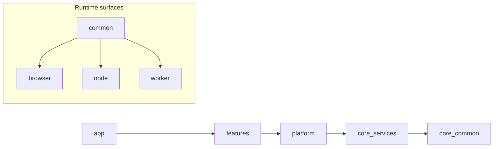

# Phase 3–4 Adoption Playbook: Architectural Enforcement and Advanced Patterns for TypeScript/Node.js

> **Source grounding:** Re-validated 2026-08-01 against `microsoft/vscode@7234ef01c2cace7cfa911d792ce9c5b1f333fca5`. Claims below describe that pinned commit unless explicitly labelled as historical or as an adopter-specific adaptation. See [VALIDATION.md](VALIDATION.md) for the full audit trail.
>
> Key VS Code reference files used here:
> - `.eslint-plugin-local/code-layering.ts`
> - `.eslint-plugin-local/code-import-patterns.ts`
> - `.eslint-plugin-local/code-no-deep-import-of-internal.ts`
> - `.eslint-plugin-local/code-no-static-node-module-import.ts`
> - `.eslint-plugin-local/index.ts`
> - `eslint.config.js`
> - `src/vs/platform/instantiation/common/instantiation.ts`
> - `src/vs/platform/instantiation/common/extensions.ts`
> - `src/vs/platform/instantiation/common/serviceCollection.ts`
> - `src/vs/platform/instantiation/common/instantiationService.ts`
> - `src/vs/workbench/common/contributions.ts`
> - `src/vs/workbench/contrib/files/browser/files.contribution.ts`
> - `src/vscode-dts/README.md`
> - `src/vscode-dts/vscode.d.ts`
> - `src/vscode-dts/vscode.proposed.chatParticipantAdditions.d.ts`
> - `build/checker/layersChecker.ts`
> - `.github/workflows/component-fixtures.yml`
> - `package.json` scripts `vscode-dts-compile-check` and `valid-layers-check`
>
> Historical note: `screenshot-test.yml` (deleted 2026-05-08, renamed to `component-fixtures.yml`) and `api-proposal-version-check.yml` (deleted 2026-06-16 by #321391, "Remove API version concept") existed at the older source commit but **do not exist** at the pinned 2026-08-01 commit.
> - `.github/workflows/pr.yml`
> - `.github/workflows/pr-linux-test.yml`
> - `src/tsconfig.base.json`
> - `src/tsconfig.json`
> - `src/tsconfig.tsec.json`
> - `extensions/json-language-features/package.json`

---

# Phase 3: Architectural Enforcement

## 3.1 Layered Architecture Design

### Why

VS Code’s architecture is intentionally layered:

`base → platform → editor → workbench → code`

That hierarchy is reinforced by local ESLint rules (`.eslint-plugin-local/code-layering.ts`, `.eslint-plugin-local/code-import-patterns.ts`) and by runtime/environment partitioning under folders like:

- `common`
- `browser`
- `node`
- `electron-browser`
- `electron-main`
- `electron-utility`

The important lesson is **not** “copy VS Code’s folder names verbatim.” The lesson is:

1. Make dependency direction obvious.
2. Make illegal imports mechanically detectable.
3. Separate code by both **abstraction level** and **runtime surface**.

> **Note**: VS Code also benefits from physical process boundaries (renderer, main process, workers, extension host). Your web app usually does **not**. In a web app, the boundaries below are logical boundaries enforced by linting, code review, and CI—not runtime isolation.

### How

#### VS Code’s layer hierarchy

| VS Code layer | Responsibility | Examples |
|---|---|---|
| `base` | Primitive utilities with no product knowledge | collections, async helpers, disposables, events |
| `platform` | Reusable infrastructure/services | logging, configuration, DI, storage, commands |
| `editor` | Generic editor engine concerns | model, tokens, editor widgets |
| `workbench` | Product shell and feature composition | views, panels, contribution system |
| `code` | Top-level product bootstrap | startup wiring, application shell |

#### VS Code’s environment sub-layers

| Sub-layer | Meaning |
|---|---|
| `common` | Safe in all runtimes |
| `browser` | DOM/browser-only |
| `node` | Node-only |
| `electron-browser` | Electron renderer-specific |
| `electron-main` | Electron main-process-specific |
| `electron-utility` | Electron utility-process-specific |

#### Recommended adaptation for a TypeScript/Node.js web product

Use this simpler hierarchy:

`core/common → core/services → platform → features → app`

| Your layer | Equivalent intent | Allowed to import |
|---|---|---|
| `core/common` | pure primitives, types, utilities | only itself |
| `core/services` | domain-agnostic services/contracts | `core/common` |
| `platform` | infrastructure adapters | `core/common`, `core/services` |
| `features` | business features | `core/common`, `core/services`, `platform` |
| `app` | composition root and bootstrap | all lower layers |

#### Runtime sub-layers to keep

For a modern TS project, use:

- `common`
- `browser`
- `node`
- `worker`

Only add `electron-*` if you are actually shipping Electron.

#### Dependency flow diagram



#### Directory structure template

```text
src/
  core/
    common/
      errors/
      events/
      types/
      utils/
    services/
      auth/
      configuration/
      logging/
      storage/
  platform/
    browser/
      http/
      router/
      telemetry/
    node/
      fs/
      process/
    worker/
      queue/
  features/
    notifications/
      common/
      browser/
      node/
      notifications.api.ts
      notifications.service.ts
      notifications.contribution.ts
      index.ts
    search/
      common/
      browser/
      search.api.ts
      search.service.ts
      search.contribution.ts
      index.ts
  app/
    browser/
      bootstrap.ts
      composition-root.ts
    node/
      server.ts
```

#### File placement rules

| File type | Where it goes | Rule |
|---|---|---|
| Pure type aliases, Result/Either, utility functions | `src/core/common/**` | must not import feature code |
| Service contracts and tokens | `src/core/services/**` | define interfaces, not UI |
| HTTP client, DB adapters, logger impls | `src/platform/**` | infra only |
| Feature state, handlers, views | `src/features/<name>/**` | never import another feature’s internals |
| App bootstrap and wiring | `src/app/**` | compose everything, own startup order |

#### Public API rule for features

Each feature gets one stable entrypoint:

- `src/features/notifications/index.ts`
- `src/features/notifications/notifications.api.ts`

Other features may import only from those public files, not from deep subpaths.

### Gotchas

1. **Do not let `platform` become “misc/`.**
   If `platform` starts containing domain behavior, you created a junk drawer.

2. **Do not put feature-shared types inside another feature.**
   Move them to `core/common` or `core/services`.

3. **Do not over-split early.**
   For a small codebase, use fewer layers. Add more only when you can enforce them.

4. **Do not cargo-cult Electron sublayers into a browser app.**
   If you do not have an Electron main process, do not invent `electron-main`.

---

## 3.2 Custom ESLint Rules for Architecture

### Why

VS Code uses local ESLint rules instead of relying only on human review. The relevant upstream files are:

- `.eslint-plugin-local/code-layering.ts`
- `.eslint-plugin-local/code-import-patterns.ts`
- `.eslint-plugin-local/code-no-deep-import-of-internal.ts`
- `.eslint-plugin-local/code-no-static-node-module-import.ts`
- `.eslint-plugin-local/index.ts`
- `eslint.config.js`

That is the right model for teams: **make architecture violations fail in CI.**

---

### Local plugin file layout

```text
.eslint-plugin-local/
  tsconfig.json
  index.ts
  utils.ts
  code-layering.ts
  code-import-patterns.ts
  code-no-deep-import-of-internal.ts
  code-no-static-heavy-module-import.ts
  tests/
    code-layering.test.ts
    code-import-patterns.test.ts
eslint.config.js
```

---

### File: `.eslint-plugin-local/tsconfig.json`

```json
{
  "extends": "../tsconfig.json",
  "compilerOptions": {
    "target": "ES2022",
    "module": "NodeNext",
    "moduleResolution": "NodeNext",
    "outDir": "./dist",
    "rootDir": ".",
    "declaration": false,
    "sourceMap": false,
    "strict": true,
    "noEmit": false,
    "types": ["node"]
  },
  "include": ["./**/*.ts"]
}
```

---

### File: `.eslint-plugin-local/utils.ts`

> 🔗 **Modeled on VS Code:** [`.eslint-plugin-local/utils.ts`](https://github.com/microsoft/vscode/blob/7234ef01c2cace7cfa911d792ce9c5b1f333fca5/.eslint-plugin-local/utils.ts) @ `7234ef0`

```ts
import path from 'node:path';
import type { Rule } from 'eslint';
import { TSESTree } from '@typescript-eslint/utils';
import { minimatch } from 'minimatch';

export type AliasMap = Record<string, string>;

export function createImportRuleListener(
  validateImport: (node: TSESTree.Literal, value: string) => void
): Rule.RuleListener {
  function check(node: TSESTree.Node | null | undefined): void {
    if (node?.type === 'Literal' && typeof node.value === 'string') {
      validateImport(node, node.value);
    }
  }

  return {
    ImportDeclaration(node): void {
      check((node as TSESTree.ImportDeclaration).source);
    },
    ExportAllDeclaration(node): void {
      check((node as TSESTree.ExportAllDeclaration).source);
    },
    ExportNamedDeclaration(node): void {
      check((node as TSESTree.ExportNamedDeclaration).source);
    },
    ['TSImportEqualsDeclaration > TSExternalModuleReference > Literal'](
      node: TSESTree.Literal
    ): void {
      check(node);
    },
    ['CallExpression[callee.type="Import"][arguments.length=1] > Literal'](
      node: TSESTree.Literal
    ): void {
      check(node);
    }
  };
}

export function normalizeSlashes(value: string): string {
  return value.replace(/\\/g, '/');
}

export function toProjectRelative(filePath: string, rootDir: string): string {
  const absoluteRoot = path.resolve(rootDir);
  const absoluteFile = path.resolve(filePath);
  return normalizeSlashes(path.relative(absoluteRoot, absoluteFile));
}

export function isRelativeImport(specifier: string): boolean {
  return specifier.startsWith('./') || specifier.startsWith('../');
}

export function isBarePackageImport(specifier: string): boolean {
  return !isRelativeImport(specifier) && !specifier.startsWith('/');
}

export function matchesAny(value: string, patterns: string[]): boolean {
  return patterns.some(pattern => minimatch(value, pattern, { dot: true }));
}

export function resolveInternalImport(
  importerRelativePath: string,
  specifier: string,
  aliases: AliasMap
): string | null {
  const importerDir = path.posix.dirname(normalizeSlashes(importerRelativePath));

  if (isRelativeImport(specifier)) {
    return path.posix.normalize(path.posix.join(importerDir, specifier));
  }

  for (const [alias, target] of Object.entries(aliases).sort((a, b) => b[0].length - a[0].length)) {
    if (specifier === alias || specifier.startsWith(`${alias}/`)) {
      const rest = specifier === alias ? '' : specifier.slice(alias.length + 1);
      return path.posix.normalize(path.posix.join(normalizeSlashes(target), rest));
    }
  }

  return null;
}

export function findFirstMatch<T extends { patterns: string[] }>(
  relativePath: string,
  items: readonly T[]
): T | undefined {
  return items.find(item => matchesAny(relativePath, item.patterns));
}

export function removeExtension(value: string): string {
  return value.replace(/\.[^.]+$/, '');
}
```

---

## 3.2.1 Layer Enforcement Rule (`code-layering`)

### Why

VS Code’s `.eslint-plugin-local/code-layering.ts` walks imports, determines the importing file’s layer, and blocks imports from disallowed layers.

You want the same behavior, but with:

- configurable project root
- explicit layer patterns
- better messages
- suggested fixes

### How

#### File: `.eslint-plugin-local/code-layering.ts`

> 🔗 **Modeled on VS Code:** [`.eslint-plugin-local/code-layering.ts`](https://github.com/microsoft/vscode/blob/7234ef01c2cace7cfa911d792ce9c5b1f333fca5/.eslint-plugin-local/code-layering.ts) @ `7234ef0`

```ts
import type { Rule } from 'eslint';
import { createImportRuleListener, findFirstMatch, resolveInternalImport, toProjectRelative } from './utils.js';

type LayerDefinition = {
  name: string;
  patterns: string[];
  canImportFrom: string[];
  publicEntrypoints?: string[];
};

type Options = [{
  rootDir: string;
  aliases?: Record<string, string>;
  layers: LayerDefinition[];
}];

type MessageIds = 'layerViolation';

const rule: Rule.RuleModule = {
  meta: {
    type: 'problem',
    docs: {
      description: 'Enforce architectural layer boundaries.'
    },
    schema: [
      {
        type: 'object',
        properties: {
          rootDir: { type: 'string' },
          aliases: { type: 'object' },
          layers: {
            type: 'array',
            items: {
              type: 'object',
              required: ['name', 'patterns', 'canImportFrom'],
              properties: {
                name: { type: 'string' },
                patterns: {
                  type: 'array',
                  items: { type: 'string' }
                },
                canImportFrom: {
                  type: 'array',
                  items: { type: 'string' }
                },
                publicEntrypoints: {
                  type: 'array',
                  items: { type: 'string' }
                }
              }
            }
          }
        },
        required: ['rootDir', 'layers'],
        additionalProperties: false
      }
    ],
    messages: {
      layerViolation:
        'Layer violation: "{{importer}}" belongs to layer "{{importerLayer}}" and cannot import "{{imported}}" from layer "{{importedLayer}}". Allowed source layers: {{allowed}}.{{suggestion}}'
    }
  },

  create(context) {
    const [config] = (context.options as Options) ?? [];
    if (!config) {
      return {};
    }

    const aliases = config.aliases ?? {};
    const importerRelativePath = toProjectRelative(context.filename, config.rootDir);
    const importerLayer = findFirstMatch(importerRelativePath, config.layers);

    if (!importerLayer) {
      return {};
    }

    return createImportRuleListener((node, specifier) => {
      const importedInternalPath = resolveInternalImport(importerRelativePath, specifier, aliases);

      if (!importedInternalPath) {
        return;
      }

      const importedLayer = findFirstMatch(importedInternalPath, config.layers);
      if (!importedLayer) {
        return;
      }

      if (importerLayer.name === importedLayer.name) {
        return;
      }

      if (importerLayer.canImportFrom.includes(importedLayer.name)) {
        return;
      }

      const suggestion =
        importedLayer.publicEntrypoints && importedLayer.publicEntrypoints.length > 0
          ? ` Import via one of: ${importedLayer.publicEntrypoints.join(', ')}`
          : ' Move shared contracts lower, or expose a public entrypoint.';

      context.report({
        node,
        messageId: 'layerViolation',
        data: {
          importer: importerRelativePath,
          importerLayer: importerLayer.name,
          imported: importedInternalPath,
          importedLayer: importedLayer.name,
          allowed: importerLayer.canImportFrom.join(', ') || '(none)',
          suggestion
        }
      });
    });
  }
};

export default rule;
```

#### Proposed adopter file: `.eslint-plugin-local/tests/code-layering.test.ts` (not present in the pinned VS Code repository)

```ts
import { after, afterEach, before, beforeEach, describe, it } from 'node:test';
import { RuleTester } from '@typescript-eslint/rule-tester';
import tsParser from '@typescript-eslint/parser';
import rule from '../code-layering.mjs';

RuleTester.afterAll = after;
RuleTester.afterEach = afterEach;
RuleTester.beforeAll = before;
RuleTester.beforeEach = beforeEach;
RuleTester.describe = describe;
RuleTester.it = it;

const tester = new RuleTester({
  languageOptions: {
    parser: tsParser,
    sourceType: 'module',
    ecmaVersion: 2022
  }
});

const options = [{
  rootDir: '/repo',
  aliases: {
    '@': 'src'
  },
  layers: [
    {
      name: 'core-common',
      patterns: ['src/core/common/**/*.ts'],
      canImportFrom: []
    },
    {
      name: 'core-services',
      patterns: ['src/core/services/**/*.ts'],
      canImportFrom: ['core-common']
    },
    {
      name: 'platform',
      patterns: ['src/platform/**/*.ts'],
      canImportFrom: ['core-common', 'core-services']
    },
    {
      name: 'features',
      patterns: ['src/features/**/*.ts'],
      canImportFrom: ['core-common', 'core-services', 'platform'],
      publicEntrypoints: ['src/features/*/index.ts', 'src/features/*/*.api.ts']
    },
    {
      name: 'app',
      patterns: ['src/app/**/*.ts'],
      canImportFrom: ['core-common', 'core-services', 'platform', 'features']
    }
  ]
}];

tester.run('code-layering', rule, {
  valid: [
    {
      filename: '/repo/src/features/notifications/browser/view.ts',
      code: "import { httpClient } from '@/platform/browser/http/client.js';",
      options
    },
    {
      filename: '/repo/src/platform/browser/http/client.ts',
      code: "import { Result } from '@/core/common/result.js';",
      options
    },
    {
      filename: '/repo/src/app/browser/bootstrap.ts',
      code: "import { registerNotifications } from '@/features/notifications/index.js';",
      options
    }
  ],
  invalid: [
    {
      filename: '/repo/src/platform/browser/http/client.ts',
      code: "import { createToast } from '@/features/notifications/browser/toast.js';",
      options,
      errors: [
        {
          messageId: 'layerViolation'
        }
      ]
    },
    {
      filename: '/repo/src/core/services/logging/logger.ts',
      code: "import { httpClient } from '@/platform/browser/http/client.js';",
      options,
      errors: [
        {
          messageId: 'layerViolation'
        }
      ]
    }
  ]
});
```

### Gotchas

- This rule only works if your path aliases are deterministic.
- If feature public APIs are not centralized, developers will fight the rule.
- Do not mark everything as `app`; that removes the value of enforcement.

---

## 3.2.2 Import Pattern Rule (`code-import-patterns`)

### Why

VS Code’s `.eslint-plugin-local/code-import-patterns.ts` is stricter than plain layering. It enforces:

- allowed import path patterns per target
- relative imports inside a layer
- ESM extension discipline (`.js`, `.css`)
- filename coverage (files should match some rule)

That is what makes the architecture operational, not aspirational.

### How

#### File: `.eslint-plugin-local/code-import-patterns.ts`

> 🔗 **Modeled on VS Code:** [`.eslint-plugin-local/code-import-patterns.ts`](https://github.com/microsoft/vscode/blob/7234ef01c2cace7cfa911d792ce9c5b1f333fca5/.eslint-plugin-local/code-import-patterns.ts) @ `7234ef0`

```ts
import type { Rule } from 'eslint';
import {
  createImportRuleListener,
  isBarePackageImport,
  isRelativeImport,
  matchesAny,
  resolveInternalImport,
  toProjectRelative
} from './utils.js';

type PatternRule = {
  name: string;
  target: string[];
  allow: string[];
  allowPackages?: string[];
  requireExtension?: boolean;
  relativeWithinTarget?: boolean;
};

type Options = [{
  rootDir: string;
  aliases?: Record<string, string>;
  allowedExtensions?: string[];
  patterns: PatternRule[];
}];

type MessageIds =
  | 'missingPattern'
  | 'badImport'
  | 'mustBeRelative'
  | 'missingExtension';

const rule: Rule.RuleModule = {
  meta: {
    type: 'problem',
    docs: {
      description: 'Enforce allowed import patterns, relative imports, and ESM extensions.'
    },
    schema: [
      {
        type: 'object',
        required: ['rootDir', 'patterns'],
        properties: {
          rootDir: { type: 'string' },
          aliases: { type: 'object' },
          allowedExtensions: {
            type: 'array',
            items: { type: 'string' }
          },
          patterns: {
            type: 'array',
            items: {
              type: 'object',
              required: ['name', 'target', 'allow'],
              properties: {
                name: { type: 'string' },
                target: {
                  type: 'array',
                  items: { type: 'string' }
                },
                allow: {
                  type: 'array',
                  items: { type: 'string' }
                },
                allowPackages: {
                  type: 'array',
                  items: { type: 'string' }
                },
                requireExtension: { type: 'boolean' },
                relativeWithinTarget: { type: 'boolean' }
              }
            }
          }
        },
        additionalProperties: false
      }
    ],
    messages: {
      missingPattern:
        'No code-import-patterns rule matched "{{file}}". Add the file to the architecture policy.',
      badImport:
        'Import "{{importPath}}" is not allowed for rule "{{ruleName}}". Allowed internal patterns: {{allowed}}. Allowed packages: {{allowedPackages}}.',
      mustBeRelative:
        'Import "{{importPath}}" stays inside "{{ruleName}}" and must be relative.',
      missingExtension:
        'Import "{{importPath}}" must include one of these ESM extensions: {{extensions}}.'
    }
  },

  create(context) {
    const [config] = (context.options as Options) ?? [];
    if (!config) {
      return {};
    }

    const aliases = config.aliases ?? {};
    const allowedExtensions = config.allowedExtensions ?? ['.js', '.css', '.json'];
    const importerRelativePath = toProjectRelative(context.filename, config.rootDir);

    const matchedRule = config.patterns.find(ruleDef =>
      matchesAny(importerRelativePath, ruleDef.target)
    );

    if (!matchedRule) {
      return {
        Program(node) {
          context.report({
            node,
            messageId: 'missingPattern',
            data: { file: importerRelativePath }
          });
        }
      };
    }

    return createImportRuleListener((node, specifier) => {
      const internalImportPath = resolveInternalImport(importerRelativePath, specifier, aliases);

      if (internalImportPath) {
        if (
          matchedRule.requireExtension &&
          !allowedExtensions.some(extension => specifier.endsWith(extension))
        ) {
          context.report({
            node,
            messageId: 'missingExtension',
            data: {
              importPath: specifier,
              extensions: allowedExtensions.join(', ')
            }
          });
          return;
        }

        if (
          matchedRule.relativeWithinTarget &&
          matchesAny(internalImportPath, matchedRule.target) &&
          !isRelativeImport(specifier)
        ) {
          context.report({
            node,
            messageId: 'mustBeRelative',
            data: {
              importPath: specifier,
              ruleName: matchedRule.name
            }
          });
          return;
        }

        if (!matchesAny(internalImportPath, matchedRule.allow)) {
          context.report({
            node,
            messageId: 'badImport',
            data: {
              importPath: specifier,
              ruleName: matchedRule.name,
              allowed: matchedRule.allow.join(', '),
              allowedPackages: (matchedRule.allowPackages ?? []).join(', ') || '(none)'
            }
          });
        }

        return;
      }

      if (isBarePackageImport(specifier)) {
        const allowedPackages = matchedRule.allowPackages ?? [];
        if (!matchesAny(specifier, allowedPackages)) {
          context.report({
            node,
            messageId: 'badImport',
            data: {
              importPath: specifier,
              ruleName: matchedRule.name,
              allowed: matchedRule.allow.join(', '),
              allowedPackages: allowedPackages.join(', ') || '(none)'
            }
          });
        }
      }
    });
  }
};

export default rule;
```

#### Proposed adopter file: `.eslint-plugin-local/tests/code-import-patterns.test.ts` (not present in the pinned VS Code repository — upstream has only `tests/code-no-observable-get-in-reactive-context-test.ts` and `tests/code-no-reader-after-await-test.ts`, note the `-test.ts` suffix)

```ts
import { after, afterEach, before, beforeEach, describe, it } from 'node:test';
import { RuleTester } from '@typescript-eslint/rule-tester';
import tsParser from '@typescript-eslint/parser';
import rule from '../code-import-patterns.js';

RuleTester.afterAll = after;
RuleTester.afterEach = afterEach;
RuleTester.beforeAll = before;
RuleTester.beforeEach = beforeEach;
RuleTester.describe = describe;
RuleTester.it = it;

const tester = new RuleTester({
  languageOptions: {
    parser: tsParser,
    sourceType: 'module',
    ecmaVersion: 2022
  }
});

const options = [{
  rootDir: '/repo',
  aliases: {
    '@': 'src'
  },
  allowedExtensions: ['.js', '.css'],
  patterns: [
    {
      name: 'core-common',
      target: ['src/core/common/**/*.ts'],
      allow: ['src/core/common/**'],
      allowPackages: ['node:*', 'zod'],
      requireExtension: true,
      relativeWithinTarget: true
    },
    {
      name: 'notifications-feature',
      target: ['src/features/notifications/**/*.ts'],
      allow: [
        'src/core/common/**',
        'src/core/services/**',
        'src/platform/**',
        'src/features/notifications/**'
      ],
      allowPackages: ['react', 'node:*'],
      requireExtension: true,
      relativeWithinTarget: true
    }
  ]
}];

tester.run('code-import-patterns', rule, {
  valid: [
    {
      filename: '/repo/src/features/notifications/browser/view.ts',
      code: "import { renderToast } from './toast.js';",
      options
    },
    {
      filename: '/repo/src/features/notifications/browser/view.ts',
      code: "import { httpClient } from '@/platform/browser/http/client.js';",
      options
    },
    {
      filename: '/repo/src/core/common/result.ts',
      code: "import { z } from 'zod';",
      options
    }
  ],
  invalid: [
    {
      filename: '/repo/src/features/notifications/browser/view.ts',
      code: "import { renderToast } from '@/features/notifications/browser/toast.js';",
      options,
      errors: [{ messageId: 'mustBeRelative' }]
    },
    {
      filename: '/repo/src/features/notifications/browser/view.ts',
      code: "import { searchApi } from '@/features/search/search.api.js';",
      options,
      errors: [{ messageId: 'badImport' }]
    },
    {
      filename: '/repo/src/features/notifications/browser/view.ts',
      code: "import { renderToast } from './toast';",
      options,
      errors: [{ messageId: 'missingExtension' }]
    },
    {
      filename: '/repo/src/core/common/result.ts',
      code: "import React from 'react';",
      options,
      errors: [{ messageId: 'badImport' }]
    }
  ]
});
```

### Gotchas

- This rule is where teams often discover hidden architecture drift.
- Turn it on as `warn` first and only later promote to `error`.
- If aliases are unstable between tools, import resolution will drift.

---

## 3.2.3 No Deep Internal Imports Rule

### Why

VS Code’s `.eslint-plugin-local/code-no-deep-import-of-internal.ts` prevents modules from reaching into another module’s internals. That is critical because layering alone is not enough; you also need **module API boundaries**.

### How

#### File: `.eslint-plugin-local/code-no-deep-import-of-internal.ts`

> 🔗 **Modeled on VS Code:** [`.eslint-plugin-local/code-no-deep-import-of-internal.ts`](https://github.com/microsoft/vscode/blob/7234ef01c2cace7cfa911d792ce9c5b1f333fca5/.eslint-plugin-local/code-no-deep-import-of-internal.ts) @ `7234ef0`

```ts
import type { Rule } from 'eslint';
import {
  createImportRuleListener,
  matchesAny,
  resolveInternalImport,
  toProjectRelative
} from './utils.js';

type Options = [{
  rootDir: string;
  aliases?: Record<string, string>;
  internalGlobs: string[];
  allowImporterGlobs?: string[];
}];

const rule: Rule.RuleModule = {
  meta: {
    type: 'problem',
    docs: {
      description: 'Prevent deep imports into another module’s internal files.'
    },
    schema: [
      {
        type: 'object',
        required: ['rootDir', 'internalGlobs'],
        properties: {
          rootDir: { type: 'string' },
          aliases: { type: 'object' },
          internalGlobs: {
            type: 'array',
            items: { type: 'string' }
          },
          allowImporterGlobs: {
            type: 'array',
            items: { type: 'string' }
          }
        },
        additionalProperties: false
      }
    ],
    messages: {
      noDeepImport:
        'Deep import of internal module "{{imported}}" is not allowed from "{{importer}}". Only the direct parent module "{{parentModule}}" may import it.'
    }
  },

  create(context) {
    const [config] = (context.options as Options) ?? [];
    if (!config) {
      return {};
    }

    const aliases = config.aliases ?? {};
    const allowImporterGlobs = config.allowImporterGlobs ?? [];
    const importerRelativePath = toProjectRelative(context.filename, config.rootDir);

    return createImportRuleListener((node, specifier) => {
      const importedInternalPath = resolveInternalImport(importerRelativePath, specifier, aliases);
      if (!importedInternalPath) {
        return;
      }

      if (!matchesAny(importedInternalPath, config.internalGlobs)) {
        return;
      }

      if (matchesAny(importerRelativePath, allowImporterGlobs)) {
        return;
      }

      const normalized = importedInternalPath;
      const internalFolderIndex = normalized.indexOf('/internal/');
      const parentModule =
        internalFolderIndex >= 0
          ? normalized.slice(0, internalFolderIndex)
          : normalized.replace(/\/[^/]*Internal\.[^.]+$/, '');

      if (!importerRelativePath.startsWith(parentModule)) {
        context.report({
          node,
          messageId: 'noDeepImport',
          data: {
            imported: importedInternalPath,
            importer: importerRelativePath,
            parentModule
          }
        });
      }
    });
  }
};

export default rule;
```

### Gotchas

- Barrel files are your friend here. Re-export safe APIs from `index.ts`.
- Use this rule only if you are serious about public entrypoints.
- Test files often need exceptions.

---

## 3.2.4 No Static Heavy Module Imports Rule

### Why

VS Code's `.eslint-plugin-local/code-no-static-node-module-import.ts` bans static imports of **all** third-party `node_modules` packages in selected startup paths, while allowing Node built-ins, Electron, relative imports, type-only imports, and allowlisted files. The curated `heavyModules` rule below is an intentionally narrower adopter-specific adaptation, not an upstream file.

That matters for:

- CLI startup
- SSR cold starts
- edge/serverless boot
- Electron/browser bootstrap

### How

#### Adopter file: `.eslint-plugin-local/code-no-static-heavy-module-import.ts` (narrower adaptation; upstream VS Code's equivalent is `code-no-static-node-module-import.ts`)

> 🔗 **Modeled on VS Code:** [`.eslint-plugin-local/code-no-static-node-module-import.ts`](https://github.com/microsoft/vscode/blob/7234ef01c2cace7cfa911d792ce9c5b1f333fca5/.eslint-plugin-local/code-no-static-node-module-import.ts) @ `7234ef0` — upstream bans *all* third-party packages; the rule below is narrower

```ts
import type { Rule } from 'eslint';
import { builtinModules } from 'node:module';
import { minimatch } from 'minimatch';
import { toProjectRelative } from './utils.js';

type Options = [{
  rootDir: string;
  startupEntrypoints: string[];
  heavyModules: string[];
  allowIn?: string[];
}];

const builtins = new Set([
  ...builtinModules,
  ...builtinModules.map(name => `node:${name}`)
]);

const rule: Rule.RuleModule = {
  meta: {
    type: 'problem',
    docs: {
      description: 'Disallow static imports of heavy packages in startup code.'
    },
    schema: [
      {
        type: 'object',
        required: ['rootDir', 'startupEntrypoints', 'heavyModules'],
        properties: {
          rootDir: { type: 'string' },
          startupEntrypoints: {
            type: 'array',
            items: { type: 'string' }
          },
          heavyModules: {
            type: 'array',
            items: { type: 'string' }
          },
          allowIn: {
            type: 'array',
            items: { type: 'string' }
          }
        },
        additionalProperties: false
      }
    ],
    messages: {
      staticHeavyImport:
        'Static import of heavy module "{{moduleName}}" is not allowed in startup path "{{file}}". Use `await import(...)`, lazy DI, or `import type`.'
    }
  },

  create(context) {
    const [config] = (context.options as Options) ?? [];
    if (!config) {
      return {};
    }

    const file = toProjectRelative(context.filename, config.rootDir);
    const isStartupFile = config.startupEntrypoints.some(pattern => minimatch(file, pattern, { dot: true }));
    const isAllowedFile = (config.allowIn ?? []).some(pattern => minimatch(file, pattern, { dot: true }));

    if (!isStartupFile || isAllowedFile) {
      return {};
    }

    function reportIfNeeded(
      node: Rule.Node,
      importKind: 'type' | 'value' | undefined,
      specifier: string | null | undefined
    ): void {
      if (!specifier || importKind === 'type') {
        return;
      }

      if (specifier.startsWith('.') || builtins.has(specifier)) {
        return;
      }

      if (!config.heavyModules.includes(specifier)) {
        return;
      }

      context.report({
        node,
        messageId: 'staticHeavyImport',
        data: {
          moduleName: specifier,
          file
        }
      });
    }

    return {
      ImportDeclaration(node) {
        reportIfNeeded(node, node.importKind as 'type' | 'value' | undefined, node.source.value as string);
      },
      ExportNamedDeclaration(node) {
        if (node.source) {
          reportIfNeeded(node, (node.exportKind ?? 'value') as 'type' | 'value', node.source.value as string);
        }
      },
      ExportAllDeclaration(node) {
        if (node.source) {
          reportIfNeeded(node, (node.exportKind ?? 'value') as 'type' | 'value', node.source.value as string);
        }
      }
    };
  }
};

export default rule;
```

### Gotchas

- Only apply this to known startup files.
- Do not call everything “heavy”; keep the list curated.
- If a package is only used for types, `import type` should remain allowed.

---

### File: `.eslint-plugin-local/index.ts`

> 🔗 **Modeled on VS Code:** [`.eslint-plugin-local/index.ts`](https://github.com/microsoft/vscode/blob/7234ef01c2cace7cfa911d792ce9c5b1f333fca5/.eslint-plugin-local/index.ts) @ `7234ef0`

```ts
import { readdirSync } from 'node:fs';
import path from 'node:path';
import { createRequire } from 'node:module';

const require = createRequire(import.meta.url);
const rules: Record<string, unknown> = {};

for (const file of readdirSync(import.meta.dirname)) {
  if (!file.endsWith('.js')) {
    continue;
  }

  if (file === 'index.js' || file === 'utils.js') {
    continue;
  }

  const ruleName = path.basename(file, '.js');
  rules[ruleName] = require(path.join(import.meta.dirname, file)).default;
}

export { rules };
export default { rules };
```

---

### File: `eslint.config.js`

> 🔗 **Modeled on VS Code:** [`eslint.config.js`](https://github.com/microsoft/vscode/blob/7234ef01c2cace7cfa911d792ce9c5b1f333fca5/eslint.config.js) @ `7234ef0`

```js
import tseslint from 'typescript-eslint';
import localPlugin from './.eslint-plugin-local/dist/index.js';

export default tseslint.config(
  {
    ignores: [
      'dist/**',
      'coverage/**',
      '.eslint-plugin-local/dist/**'
    ]
  },
  {
    files: ['src/**/*.ts', 'test/**/*.ts'],
    languageOptions: {
      parser: tseslint.parser,
      parserOptions: {
        ecmaVersion: 2022,
        sourceType: 'module'
      }
    },
    plugins: {
      local: localPlugin
    },
    rules: {
      'local/code-layering': ['error', {
        rootDir: '.',
        aliases: {
          '@': 'src'
        },
        layers: [
          {
            name: 'core-common',
            patterns: ['src/core/common/**/*.ts'],
            canImportFrom: []
          },
          {
            name: 'core-services',
            patterns: ['src/core/services/**/*.ts'],
            canImportFrom: ['core-common']
          },
          {
            name: 'platform',
            patterns: ['src/platform/**/*.ts'],
            canImportFrom: ['core-common', 'core-services']
          },
          {
            name: 'features',
            patterns: ['src/features/**/*.ts'],
            canImportFrom: ['core-common', 'core-services', 'platform'],
            publicEntrypoints: ['src/features/*/index.ts', 'src/features/*/*.api.ts']
          },
          {
            name: 'app',
            patterns: ['src/app/**/*.ts'],
            canImportFrom: ['core-common', 'core-services', 'platform', 'features']
          }
        ]
      }],
      'local/code-import-patterns': ['error', {
        rootDir: '.',
        aliases: {
          '@': 'src'
        },
        allowedExtensions: ['.js', '.css', '.json'],
        patterns: [
          {
            name: 'core-common',
            target: ['src/core/common/**/*.ts'],
            allow: ['src/core/common/**'],
            allowPackages: ['node:*', 'zod'],
            requireExtension: true,
            relativeWithinTarget: true
          },
          {
            name: 'core-services',
            target: ['src/core/services/**/*.ts'],
            allow: ['src/core/common/**', 'src/core/services/**'],
            allowPackages: ['node:*', 'zod'],
            requireExtension: true,
            relativeWithinTarget: true
          },
          {
            name: 'platform',
            target: ['src/platform/**/*.ts'],
            allow: ['src/core/common/**', 'src/core/services/**', 'src/platform/**'],
            allowPackages: ['node:*', 'undici', 'pino'],
            requireExtension: true,
            relativeWithinTarget: true
          },
          {
            name: 'features',
            target: ['src/features/**/*.ts'],
            allow: ['src/core/common/**', 'src/core/services/**', 'src/platform/**', 'src/features/**'],
            allowPackages: ['node:*', 'react', 'react-dom', 'zod'],
            requireExtension: true,
            relativeWithinTarget: true
          },
          {
            name: 'app',
            target: ['src/app/**/*.ts'],
            allow: ['src/core/common/**', 'src/core/services/**', 'src/platform/**', 'src/features/**', 'src/app/**'],
            allowPackages: ['node:*', 'react', 'react-dom'],
            requireExtension: true,
            relativeWithinTarget: true
          }
        ]
      }],
      'local/code-no-deep-import-of-internal': ['error', {
        rootDir: '.',
        aliases: {
          '@': 'src'
        },
        internalGlobs: [
          'src/**/internal/**',
          'src/**/*Internal.ts'
        ],
        allowImporterGlobs: [
          'src/**/*.test.ts',
          'src/**/__tests__/**'
        ]
      }],
      'local/code-no-static-heavy-module-import': ['error', {
        rootDir: '.',
        startupEntrypoints: [
          'src/app/**/*.ts',
          'src/platform/**/bootstrap*.ts'
        ],
        heavyModules: [
          'sharp',
          'better-sqlite3',
          'sqlite3',
          'pdfjs-dist',
          'playwright'
        ],
        allowIn: [
          'src/app/debug/**'
        ]
      }]
    }
  }
);
```

---

## 3.3 Dependency Cruiser as an Alternative

### Why

If you want architecture enforcement without maintaining custom ESLint logic, `dependency-cruiser` is the best alternative.

Use it for:

- layer boundaries
- circular dependency detection
- cross-feature import prevention
- orphan module detection
- visual graphs
- gradual adoption via baseline files

VS Code uses a mix of custom linting and custom dependency checks (`build/checker/layersChecker.ts`, plus cyclic dependency checks in CI). For a typical product, `dependency-cruiser` is a better first step.

### How

### File: `.dependency-cruiser.cjs`

```js
/** @type {import('dependency-cruiser').IConfiguration} */
module.exports = {
  forbidden: [
    {
      name: 'no-circular',
      severity: 'error',
      comment: 'Circular dependencies make initialization and refactoring fragile.',
      from: { path: '^src' },
      to: {
        circular: true,
        viaOnly: {
          dependencyTypesNot: ['type-only']
        }
      }
    },
    {
      name: 'no-cross-feature-imports',
      severity: 'error',
      comment: 'Features must not reach into other features. Go through public APIs or move shared code down.',
      from: { path: '^src/features/([^/]+)/' },
      to: {
        path: '^src/features/([^/]+)/',
        pathNot: '^src/features/$1/'
      }
    },
    {
      name: 'core-common-is-foundational',
      severity: 'error',
      from: { path: '^src/core/common/' },
      to: {
        path: '^src/(core/services|platform|features|app)/'
      }
    },
    {
      name: 'core-services-cannot-depend-up',
      severity: 'error',
      from: { path: '^src/core/services/' },
      to: {
        path: '^src/(platform|features|app)/'
      }
    },
    {
      name: 'platform-cannot-depend-on-features-or-app',
      severity: 'error',
      from: { path: '^src/platform/' },
      to: {
        path: '^src/(features|app)/'
      }
    },
    {
      name: 'features-cannot-depend-on-app',
      severity: 'error',
      from: { path: '^src/features/' },
      to: {
        path: '^src/app/'
      }
    },
    {
      name: 'production-code-not-to-test',
      severity: 'error',
      from: {
        path: '^src/',
        pathNot: '\\.(test|spec)\\.ts$'
      },
      to: {
        path: '(^test/|/__tests__/|\\.(test|spec)\\.ts$)'
      }
    },
    {
      name: 'no-internal-deep-imports',
      severity: 'error',
      comment: 'Import only a feature public API, not its internals.',
      from: {
        path: '^src/(features|platform)/'
      },
      to: {
        path: '^src/.*/internal/'
      }
    },
    {
      name: 'no-orphans',
      severity: 'warn',
      comment: 'Unused modules tend to hide dead architecture.',
      from: {
        orphan: true,
        path: '^src/',
        pathNot: '(^src/app/|/index\\.ts$|\\.d\\.ts$|\\.(test|spec)\\.ts$)'
      },
      to: {}
    }
  ],
  options: {
    tsConfig: {
      fileName: 'tsconfig.json'
    },
    doNotFollow: {
      path: 'node_modules'
    },
    exclude: {
      path: [
        '^dist',
        '^coverage',
        '^out',
        '\\.d\\.ts$'
      ]
    },
    reporterOptions: {
      dot: {
        collapsePattern: '^(node_modules/(@[^/]+/[^/]+|[^/]+)/)',
        filters: {
          includeOnly: { path: '^src' }
        },
        theme: {
          graph: {
            rankdir: 'LR',
            splines: 'ortho',
            bgcolor: 'transparent'
          },
          modules: [
            {
              criteria: { source: '^src/core/common/' },
              attributes: { fillcolor: '#d1fae5', style: 'filled,rounded' }
            },
            {
              criteria: { source: '^src/core/services/' },
              attributes: { fillcolor: '#bfdbfe', style: 'filled,rounded' }
            },
            {
              criteria: { source: '^src/platform/' },
              attributes: { fillcolor: '#fde68a', style: 'filled,rounded' }
            },
            {
              criteria: { source: '^src/features/' },
              attributes: { fillcolor: '#fecaca', style: 'filled,rounded' }
            },
            {
              criteria: { source: '^src/app/' },
              attributes: { fillcolor: '#ddd6fe', style: 'filled,rounded' }
            }
          ],
          dependencies: [
            {
              criteria: { circular: true },
              attributes: { color: 'red', penwidth: 2 }
            },
            {
              criteria: { valid: false },
              attributes: { color: 'red', style: 'dashed' }
            }
          ]
        }
      }
    }
  }
};
```

### Baseline for gradual adoption

Generate it once:

```bash
npx depcruise-baseline src test --config .dependency-cruiser.cjs --output-to .dependency-cruiser-known-violations.json
```

Run CI ignoring only known debt:

```bash
npx depcruise src test --config .dependency-cruiser.cjs --ignore-known .dependency-cruiser-known-violations.json
```

### CI integration script

#### File: `scripts/check-architecture.mjs`

```js
#!/usr/bin/env node
import { execSync } from 'node:child_process';

function run(command) {
  execSync(command, { stdio: 'inherit' });
}

run('npx depcruise src test --config .dependency-cruiser.cjs --ignore-known .dependency-cruiser-known-violations.json');
```

### Visual graph generation

```bash
npx depcruise src --config .dependency-cruiser.cjs --output-type dot | dot -Tsvg > architecture-deps.svg
```

### Gotchas

- The baseline file is **machine-generated debt**, not policy.
- If you overuse exceptions, the graph loses meaning.
- Orphan detection is noisy until your entrypoints are well defined.

---

## 3.4 Service-Oriented Architecture with DI

### Why

VS Code’s DI model is centered on:

- `createDecorator<T>()` in `src/vs/platform/instantiation/common/instantiation.ts`
- `ServiceCollection` in `src/vs/platform/instantiation/common/serviceCollection.ts`
- singleton registration in `src/vs/platform/instantiation/common/extensions.ts`
- graph-based instantiation in `src/vs/platform/instantiation/common/instantiationService.ts`

The key design is:

- services are identified by tokens, not classes
- constructors declare dependencies explicitly
- implementations are swappable in tests
- lazy instantiation is supported

### How

> **Note**: This is intentionally simpler than VS Code. It keeps the architecture and testability benefits without copying every edge case.

### File: `src/platform/di/instantiation.ts`

```ts
export type BrandedService = { readonly _serviceBrand: undefined };

export interface ServiceIdentifier<T> {
  (...args: unknown[]): void;
  readonly type: T;
  toString(): string;
}

export interface ServicesAccessor {
  get<T>(id: ServiceIdentifier<T>): T;
}

type DependencyRecord = { id: ServiceIdentifier<unknown>; index: number };

const serviceIds = new Map<string, ServiceIdentifier<unknown>>();
const DI_DEPENDENCIES = '$di$dependencies';

type DependencyAwareTarget = Function & {
  [DI_DEPENDENCIES]?: DependencyRecord[];
};

export function getServiceDependencies(target: Function): DependencyRecord[] {
  return ((target as DependencyAwareTarget)[DI_DEPENDENCIES] ?? []).slice().sort((a, b) => a.index - b.index);
}

function storeDependency(id: ServiceIdentifier<unknown>, target: Function, index: number): void {
  const typedTarget = target as DependencyAwareTarget;
  typedTarget[DI_DEPENDENCIES] ??= [];
  typedTarget[DI_DEPENDENCIES]!.push({ id, index });
}

export function createDecorator<T>(serviceId: string): ServiceIdentifier<T> {
  if (serviceIds.has(serviceId)) {
    return serviceIds.get(serviceId)! as ServiceIdentifier<T>;
  }

  const id = function (target: Function, _key: string | undefined, index: number) {
    if (arguments.length !== 3) {
      throw new Error(`@${serviceId} can only be used as a constructor parameter decorator.`);
    }
    storeDependency(id as ServiceIdentifier<unknown>, target, index);
  } as ServiceIdentifier<T>;

  id.toString = () => serviceId;
  serviceIds.set(serviceId, id);
  return id;
}

export class SyncDescriptor<T> {
  constructor(
    public readonly ctor: new (...args: any[]) => T,
    public readonly staticArguments: unknown[] = [],
    public readonly delayed: boolean = false
  ) {}
}
```

### File: `src/platform/di/serviceCollection.ts`

```ts
import { ServiceIdentifier, SyncDescriptor } from './instantiation.js';

export class ServiceCollection {
  private readonly entries = new Map<ServiceIdentifier<unknown>, unknown>();

  constructor(...initialEntries: [ServiceIdentifier<unknown>, unknown][]) {
    for (const [id, value] of initialEntries) {
      this.set(id, value);
    }
  }

  set<T>(id: ServiceIdentifier<T>, value: T | SyncDescriptor<T>): void {
    this.entries.set(id, value);
  }

  has<T>(id: ServiceIdentifier<T>): boolean {
    return this.entries.has(id);
  }

  get<T>(id: ServiceIdentifier<T>): T | SyncDescriptor<T> | undefined {
    return this.entries.get(id) as T | SyncDescriptor<T> | undefined;
  }

  entriesArray(): [ServiceIdentifier<unknown>, unknown][] {
    return [...this.entries.entries()];
  }
}
```

### File: `src/platform/di/extensions.ts`

```ts
import { BrandedService, ServiceIdentifier, SyncDescriptor } from './instantiation.js';

export const enum InstantiationType {
  Eager = 0,
  Delayed = 1
}

const singletonRegistry: [ServiceIdentifier<unknown>, SyncDescriptor<unknown>][] = [];

export function registerSingleton<T, Services extends BrandedService[]>(
  id: ServiceIdentifier<T>,
  ctor: new (...services: Services) => T,
  instantiationType: InstantiationType = InstantiationType.Delayed
): void {
  singletonRegistry.push([id, new SyncDescriptor(ctor, [], instantiationType === InstantiationType.Delayed)]);
}

export function getSingletonServiceDescriptors(): [ServiceIdentifier<unknown>, SyncDescriptor<unknown>][] {
  return singletonRegistry.slice();
}
```

### File: `src/platform/di/instantiationService.ts`

```ts
import {
  getServiceDependencies,
  ServiceIdentifier,
  ServicesAccessor,
  SyncDescriptor
} from './instantiation.js';
import { ServiceCollection } from './serviceCollection.js';

type DisposableLike = { dispose(): void };

function isDisposable(value: unknown): value is DisposableLike {
  return typeof value === 'object' && value !== null && 'dispose' in value && typeof (value as DisposableLike).dispose === 'function';
}

export class DependencyCycleError extends Error {
  constructor(chain: string[]) {
    super(`Cyclic dependency detected: ${chain.join(' -> ')}`);
  }
}

export class InstantiationService {
  private readonly disposables = new Set<DisposableLike>();

  constructor(
    private readonly services: ServiceCollection = new ServiceCollection(),
    private readonly parent?: InstantiationService
  ) {}

  createChild(extraServices: ServiceCollection): InstantiationService {
    return new InstantiationService(extraServices, this);
  }

  invokeFunction<R>(fn: (accessor: ServicesAccessor) => R): R {
    const accessor: ServicesAccessor = {
      get: <T>(id: ServiceIdentifier<T>): T => this.getOrCreateService(id, [])
    };
    return fn(accessor);
  }

  createInstance<T>(ctor: new (...args: any[]) => T, ...staticArgs: unknown[]): T {
    const dependencies = getServiceDependencies(ctor);
    const serviceArgs = dependencies.map(dep => this.getOrCreateService(dep.id, []));
    return Reflect.construct(ctor, [...staticArgs, ...serviceArgs]);
  }

  getOrCreateService<T>(id: ServiceIdentifier<T>, stack: string[]): T {
    const existing = this.services.get(id);

    if (existing instanceof SyncDescriptor) {
      return this.instantiateAndCache(id, existing, stack);
    }

    if (existing !== undefined) {
      return existing as T;
    }

    if (this.parent) {
      return this.parent.getOrCreateService(id, stack);
    }

    throw new Error(`Unknown service: ${id.toString()}`);
  }

  private instantiateAndCache<T>(id: ServiceIdentifier<T>, descriptor: SyncDescriptor<T>, stack: string[]): T {
    const key = id.toString();
    if (stack.includes(key)) {
      throw new DependencyCycleError([...stack, key]);
    }

    const nextStack = [...stack, key];

    const factory = () => {
      const dependencies = getServiceDependencies(descriptor.ctor);
      const serviceArgs = dependencies.map(dep => this.getOrCreateService(dep.id as ServiceIdentifier<unknown>, nextStack));
      const instance = Reflect.construct(descriptor.ctor, [...descriptor.staticArguments, ...serviceArgs]) as T;

      this.services.set(id, instance);
      if (isDisposable(instance)) {
        this.disposables.add(instance);
      }
      return instance;
    };

    if (!descriptor.delayed) {
      return factory();
    }

    let realized: T | undefined;
    const getRealized = () => (realized ??= factory());

    const proxy = new Proxy(
      {},
      {
        get(_target, prop) {
          const instance = getRealized() as Record<PropertyKey, unknown>;
          const value = instance[prop];
          return typeof value === 'function' ? value.bind(instance) : value;
        },
        set(_target, prop, value) {
          const instance = getRealized() as Record<PropertyKey, unknown>;
          instance[prop] = value;
          return true;
        },
        getPrototypeOf() {
          return descriptor.ctor.prototype;
        }
      }
    ) as T;

    this.services.set(id, proxy);
    return proxy;
  }

  dispose(): void {
    for (const disposable of this.disposables) {
      disposable.dispose();
    }
    this.disposables.clear();
  }
}
```

### Service token pattern

#### File: `src/core/services/logging/logging.service.ts`

```ts
import { BrandedService, createDecorator } from '../../../platform/di/instantiation.js';

export interface ILoggingService extends BrandedService {
  info(message: string, meta?: Record<string, unknown>): void;
  warn(message: string, meta?: Record<string, unknown>): void;
  error(message: string, meta?: Record<string, unknown>): void;
}

export const LOGGING_SERVICE = createDecorator<ILoggingService>('loggingService');
```

#### File: `src/core/services/preferences/preferences.service.ts`

```ts
import { BrandedService, createDecorator } from '../../../platform/di/instantiation.js';

export interface IPreferencesService extends BrandedService {
  getBoolean(key: string, fallback?: boolean): boolean;
}

export const PREFERENCES_SERVICE = createDecorator<IPreferencesService>('preferencesService');
```

#### File: `src/features/notifications/notifications.service.ts`

```ts
import { BrandedService, createDecorator } from '../../platform/di/instantiation.js';

export interface Notification {
  id: string;
  level: 'info' | 'warning' | 'error';
  message: string;
}

export interface INotificationsService extends BrandedService {
  initialize(): void;
  list(): Notification[];
  push(level: Notification['level'], message: string): Notification;
}

export const NOTIFICATIONS_SERVICE = createDecorator<INotificationsService>('notificationsService');
```

### Implementations with constructor injection

#### File: `src/platform/logging/consoleLoggingService.ts`

```ts
import { ILoggingService } from '../../core/services/logging/logging.service.js';

export class ConsoleLoggingService implements ILoggingService {
  readonly _serviceBrand = undefined;

  info(message: string, meta: Record<string, unknown> = {}): void {
    console.info(message, meta);
  }

  warn(message: string, meta: Record<string, unknown> = {}): void {
    console.warn(message, meta);
  }

  error(message: string, meta: Record<string, unknown> = {}): void {
    console.error(message, meta);
  }
}
```

#### File: `src/platform/preferences/memoryPreferencesService.ts`

```ts
import { IPreferencesService } from '../../core/services/preferences/preferences.service.js';
import { ILoggingService, LOGGING_SERVICE } from '../../core/services/logging/logging.service.js';

export class MemoryPreferencesService implements IPreferencesService {
  readonly _serviceBrand = undefined;
  private readonly values = new Map<string, boolean>([
    ['notifications.enabled', true]
  ]);

  constructor(@LOGGING_SERVICE private readonly loggingService: ILoggingService) {}

  getBoolean(key: string, fallback = false): boolean {
    const value = this.values.get(key) ?? fallback;
    this.loggingService.info('Read preference', { key, value });
    return value;
  }
}
```

#### File: `src/features/notifications/notificationsServiceImpl.ts`

```ts
import { ILoggingService, LOGGING_SERVICE } from '../../core/services/logging/logging.service.js';
import { IPreferencesService, PREFERENCES_SERVICE } from '../../core/services/preferences/preferences.service.js';
import {
  INotificationsService,
  Notification
} from './notifications.service.js';

export class NotificationsService implements INotificationsService {
  readonly _serviceBrand = undefined;
  private readonly items: Notification[] = [];

  constructor(
    @LOGGING_SERVICE private readonly loggingService: ILoggingService,
    @PREFERENCES_SERVICE private readonly preferencesService: IPreferencesService
  ) {}

  initialize(): void {
    this.loggingService.info('Initializing notifications feature', {
      enabled: this.preferencesService.getBoolean('notifications.enabled', true)
    });
  }

  list(): Notification[] {
    return [...this.items];
  }

  push(level: Notification['level'], message: string): Notification {
    const item: Notification = {
      id: crypto.randomUUID(),
      level,
      message
    };

    this.items.push(item);
    this.loggingService.info('Notification created', item);
    return item;
  }
}
```

### Singleton registration

#### File: `src/app/registerServices.ts`

```ts
import { registerSingleton, InstantiationType } from '../platform/di/extensions.js';
import { LOGGING_SERVICE } from '../core/services/logging/logging.service.js';
import { PREFERENCES_SERVICE } from '../core/services/preferences/preferences.service.js';
import { NOTIFICATIONS_SERVICE } from '../features/notifications/notifications.service.js';
import { ConsoleLoggingService } from '../platform/logging/consoleLoggingService.js';
import { MemoryPreferencesService } from '../platform/preferences/memoryPreferencesService.js';
import { NotificationsService } from '../features/notifications/notificationsServiceImpl.js';

registerSingleton(LOGGING_SERVICE, ConsoleLoggingService, InstantiationType.Eager);
registerSingleton(PREFERENCES_SERVICE, MemoryPreferencesService, InstantiationType.Delayed);
registerSingleton(NOTIFICATIONS_SERVICE, NotificationsService, InstantiationType.Delayed);
```

### Composition root

#### File: `src/app/browser/composition-root.ts`

```ts
import '../registerServices.js';
import { getSingletonServiceDescriptors } from '../../platform/di/extensions.js';
import { ServiceCollection } from '../../platform/di/serviceCollection.js';
import { InstantiationService } from '../../platform/di/instantiationService.js';
import { NOTIFICATIONS_SERVICE } from '../../features/notifications/notifications.service.js';

export function createAppServices(): InstantiationService {
  const collection = new ServiceCollection();

  for (const [id, descriptor] of getSingletonServiceDescriptors()) {
    collection.set(id, descriptor);
  }

  const instantiationService = new InstantiationService(collection);
  instantiationService.getOrCreateService(NOTIFICATIONS_SERVICE, []).initialize();

  return instantiationService;
}
```

### Test setup: swapping implementations

#### File: `test/testServices.ts`

```ts
import { InstantiationService } from '../src/platform/di/instantiationService.js';
import { ServiceCollection } from '../src/platform/di/serviceCollection.js';
import { LOGGING_SERVICE, ILoggingService } from '../src/core/services/logging/logging.service.js';
import { PREFERENCES_SERVICE, IPreferencesService } from '../src/core/services/preferences/preferences.service.js';
import { NOTIFICATIONS_SERVICE } from '../src/features/notifications/notifications.service.js';
import { SyncDescriptor } from '../src/platform/di/instantiation.js';
import { NotificationsService } from '../src/features/notifications/notificationsServiceImpl.js';

class TestLoggingService implements ILoggingService {
  readonly _serviceBrand = undefined;
  readonly logs: Array<{ level: string; message: string }> = [];

  info(message: string): void { this.logs.push({ level: 'info', message }); }
  warn(message: string): void { this.logs.push({ level: 'warn', message }); }
  error(message: string): void { this.logs.push({ level: 'error', message }); }
}

class TestPreferencesService implements IPreferencesService {
  readonly _serviceBrand = undefined;
  getBoolean(): boolean { return true; }
}

export function createTestInstantiationService(): InstantiationService {
  const services = new ServiceCollection(
    [LOGGING_SERVICE, new TestLoggingService()],
    [PREFERENCES_SERVICE, new TestPreferencesService()],
    [NOTIFICATIONS_SERVICE, new SyncDescriptor(NotificationsService)]
  );

  return new InstantiationService(services);
}
```

### Gotchas

- Use DI for services, not for every class.
- Keep service interfaces stable; implementations may churn.
- If you need decorators, enable `experimentalDecorators`.
- If the container starts becoming magical, stop and simplify.

---

## 3.5 Feature Contribution Pattern

### Why

VS Code uses `src/vs/workbench/common/contributions.ts` to register workbench contributions by lifecycle phase, and contribution entrypoints like `src/vs/workbench/contrib/files/browser/files.contribution.ts` to wire features, commands, views, and configuration.

That is the right pattern for large apps because it gives you:

- explicit activation phases
- discoverable feature entrypoints
- controlled startup cost
- easier ownership boundaries

### How

### File: `src/platform/features/featureRegistry.ts`

```ts
import { InstantiationService } from '../di/instantiationService.js';

export type FeaturePhase = 'startup' | 'restored' | 'idle' | 'on-demand';

export interface FeatureContribution {
  id: string;
  phase: FeaturePhase;
  activate(instantiationService: InstantiationService): void | Promise<void>;
}

export class FeatureRegistry {
  private readonly contributions = new Map<string, FeatureContribution>();
  private readonly activated = new Set<string>();

  register(contribution: FeatureContribution): void {
    if (this.contributions.has(contribution.id)) {
      throw new Error(`Feature "${contribution.id}" already registered.`);
    }
    this.contributions.set(contribution.id, contribution);
  }

  async activatePhase(phase: Exclude<FeaturePhase, 'on-demand'>, services: InstantiationService): Promise<void> {
    const work = [...this.contributions.values()]
      .filter(contribution => contribution.phase === phase)
      .map(contribution => this.activateById(contribution.id, services));

    await Promise.all(work);
  }

  async activateById(id: string, services: InstantiationService): Promise<void> {
    if (this.activated.has(id)) {
      return;
    }

    const contribution = this.contributions.get(id);
    if (!contribution) {
      throw new Error(`Unknown feature contribution "${id}".`);
    }

    await contribution.activate(services);
    this.activated.add(id);
  }

  list(): FeatureContribution[] {
    return [...this.contributions.values()];
  }
}

export const featureRegistry = new FeatureRegistry();
```

### File: `src/platform/commands/commandRegistry.ts`

```ts
export type CommandHandler = (...args: unknown[]) => unknown | Promise<unknown>;

export interface CommandDefinition {
  id: string;
  title: string;
  handler: CommandHandler;
}

export class CommandRegistry {
  private readonly commands = new Map<string, CommandDefinition>();

  register(command: CommandDefinition): void {
    if (this.commands.has(command.id)) {
      throw new Error(`Command "${command.id}" already registered.`);
    }
    this.commands.set(command.id, command);
  }

  async execute(id: string, ...args: unknown[]): Promise<unknown> {
    const command = this.commands.get(id);
    if (!command) {
      throw new Error(`Unknown command "${id}".`);
    }
    return command.handler(...args);
  }

  getAll(): CommandDefinition[] {
    return [...this.commands.values()];
  }
}

export const commandRegistry = new CommandRegistry();
```

### File: `src/platform/views/viewRegistry.ts`

```ts
export interface ViewDefinition {
  id: string;
  title: string;
  render(): string;
}

export class ViewRegistry {
  private readonly views = new Map<string, ViewDefinition>();

  register(view: ViewDefinition): void {
    if (this.views.has(view.id)) {
      throw new Error(`View "${view.id}" already registered.`);
    }
    this.views.set(view.id, view);
  }

  get(id: string): ViewDefinition {
    const view = this.views.get(id);
    if (!view) {
      throw new Error(`Unknown view "${id}".`);
    }
    return view;
  }

  getAll(): ViewDefinition[] {
    return [...this.views.values()];
  }
}

export const viewRegistry = new ViewRegistry();
```

### File: `src/platform/configuration/configurationRegistry.ts`

```ts
export interface ConfigurationDefinition {
  id: string;
  title: string;
  properties: Record<string, unknown>;
}

export class ConfigurationRegistry {
  private readonly sections = new Map<string, ConfigurationDefinition>();

  register(section: ConfigurationDefinition): void {
    if (this.sections.has(section.id)) {
      throw new Error(`Configuration section "${section.id}" already registered.`);
    }
    this.sections.set(section.id, section);
  }

  getAll(): ConfigurationDefinition[] {
    return [...this.sections.values()];
  }
}

export const configurationRegistry = new ConfigurationRegistry();
```

### Full example: notifications feature

#### File: `src/features/notifications/index.ts`

```ts
export * from './notifications.service.js';
```

#### File: `src/features/notifications/notifications.api.ts`

```ts
export interface NotificationDTO {
  id: string;
  level: 'info' | 'warning' | 'error';
  message: string;
}
```

#### File: `src/features/notifications/browser/notificationsView.ts`

```ts
import { NOTIFICATIONS_SERVICE } from '../notifications.service.js';
import { InstantiationService } from '../../../platform/di/instantiationService.js';

export function createNotificationsView(services: InstantiationService): string {
  const notificationsService = services.getOrCreateService(NOTIFICATIONS_SERVICE, []);
  const items = notificationsService.list();

  return `
    <section>
      <h2>Notifications</h2>
      <ul>
        ${items.map(item => `<li data-level="${item.level}">${item.message}</li>`).join('')}
      </ul>
    </section>
  `.trim();
}
```

#### File: `src/features/notifications/notifications.contribution.ts`

```ts
import { featureRegistry } from '../../platform/features/featureRegistry.js';
import { commandRegistry } from '../../platform/commands/commandRegistry.js';
import { configurationRegistry } from '../../platform/configuration/configurationRegistry.js';
import { viewRegistry } from '../../platform/views/viewRegistry.js';
import { registerSingleton, InstantiationType } from '../../platform/di/extensions.js';
import { NOTIFICATIONS_SERVICE } from './notifications.service.js';
import { NotificationsService } from './notificationsServiceImpl.js';
import { createNotificationsView } from './browser/notificationsView.js';

registerSingleton(NOTIFICATIONS_SERVICE, NotificationsService, InstantiationType.Delayed);

commandRegistry.register({
  id: 'notifications.showInfo',
  title: 'Show Info Notification',
  handler: async () => {
    throw new Error('Command handlers are rebound during activation to get DI access.');
  }
});

configurationRegistry.register({
  id: 'notifications',
  title: 'Notifications',
  properties: {
    'notifications.enabled': {
      type: 'boolean',
      default: true,
      description: 'Enable in-app notifications.'
    },
    'notifications.maxVisible': {
      type: 'number',
      default: 5,
      minimum: 1,
      maximum: 20,
      description: 'Maximum number of visible notifications.'
    }
  }
});

viewRegistry.register({
  id: 'notifications.center',
  title: 'Notifications',
  render: () => '<section>Notifications are not activated yet.</section>'
});

featureRegistry.register({
  id: 'notifications',
  phase: 'restored',
  activate: services => {
    const notificationService = services.getOrCreateService(NOTIFICATIONS_SERVICE, []);
    notificationService.initialize();

    const command = commandRegistry.getAll().find(item => item.id === 'notifications.showInfo');
    if (command) {
      command.handler = async () => {
        notificationService.push('info', 'Notification created from command.');
      };
    }

    const view = viewRegistry.get('notifications.center');
    view.render = () => createNotificationsView(services);
  }
});
```

### Activation phases

| Phase | Use for | Don’t use for |
|---|---|---|
| `startup` | minimal blocking registration | network, DB warmup, heavy imports |
| `restored` | features visible after initial shell paint | large synchronous scans |
| `idle` | low-priority hydration | user-blocking work |
| `on-demand` | commands, rarely-used panels | core shell wiring |

### Gotchas

- If a command must exist at app boot, do not wait until `restored`.
- Keep contribution files declarative; avoid putting business logic there.
- On-demand features still need public entrypoints and ownership.

---

## 3.6 Extension/Plugin API Boundaries

### Why

VS Code keeps its public extension API under `src/vscode-dts/`:

- stable API: `src/vscode-dts/vscode.d.ts`
- proposed API: `src/vscode-dts/vscode.proposed.*.d.ts`
- process guidance: `src/vscode-dts/README.md`
- runtime gating through `checkProposedApiEnabled` and/or `isProposedApiEnabled`
- compile-time validation through `npm run vscode-dts-compile-check`

> The pinned repository no longer uses proposal-version headers (`vscode.proposed.chatParticipantAdditions.d.ts` has no `// version:` line) and has no `api-proposal-version-check.yml` workflow. Version headers and a human override gate may still be adopted as project-specific policy, but must not be attributed to current VS Code.

That pattern is excellent when your project exposes a plugin surface or SDK.

### How

### Stable vs proposed API decision

| API type | Use |
|---|---|
| Internal-only feature surface | regular TS exports, no API Extractor |
| Public plugin/SDK API | stable `.d.ts` rollup + API Extractor |
| Experimental plugin API | separate proposed `.d.ts` + feature flag + version comment |

### File: `src/api/public/index.ts`

```ts
export interface NotificationHandle {
  readonly id: string;
  dismiss(): void;
}

export interface NotificationOptions {
  readonly level?: 'info' | 'warning' | 'error';
  readonly sticky?: boolean;
}

export interface NotificationsApi {
  show(message: string, options?: NotificationOptions): NotificationHandle;
  list(): readonly NotificationHandle[];
}
```

### File: `src/api/proposed/notifications-actions.proposed.d.ts`

```ts
/* eslint-disable @typescript-eslint/no-unused-vars */

// version: 1

declare module '@acme/app-api' {
  export interface ProposedNotificationsActionsApi {
    executePrimaryAction(notificationId: string): Promise<void>;
  }
}
```

### File: `src/api/proposed/featureFlags.ts`

```ts
export type ProposedApiName = 'notifications-actions';

export interface ProposedApiGate {
  isEnabled(name: ProposedApiName): boolean;
  assertEnabled(name: ProposedApiName): void;
}

export class EnvironmentProposedApiGate implements ProposedApiGate {
  constructor(private readonly enabled = new Set<ProposedApiName>(
    (process.env.ENABLED_PROPOSED_APIS ?? '')
      .split(',')
      .map(value => value.trim())
      .filter(Boolean) as ProposedApiName[]
  )) {}

  isEnabled(name: ProposedApiName): boolean {
    return this.enabled.has(name);
  }

  assertEnabled(name: ProposedApiName): void {
    if (!this.isEnabled(name)) {
      throw new Error(
        `Proposed API "${name}" is not enabled. Set ENABLED_PROPOSED_APIS=${name} for internal testing only.`
      );
    }
  }
}
```

### API versioning strategy

1. Stable APIs change under semver.
2. Proposed APIs live in separate files.
3. Proposed APIs have explicit `// version: N` headers.
4. Version bumps require a human-reviewed compatibility decision.

### File: `api-extractor.json`

```json
{
  "$schema": "https://developer.microsoft.com/json-schemas/api-extractor/v7/api-extractor.schema.json",
  "mainEntryPointFilePath": "<projectFolder>/dist/types/api/public/index.d.ts",
  "bundledPackages": [],
  "compiler": {
    "tsconfigFilePath": "<projectFolder>/tsconfig.build.json"
  },
  "apiReport": {
    "enabled": true,
    "reportFolder": "<projectFolder>/etc",
    "reportTempFolder": "<projectFolder>/temp",
    "reportFileName": "app-api.api.md"
  },
  "docModel": {
    "enabled": true,
    "apiJsonFilePath": "<projectFolder>/temp/app-api.api.json"
  },
  "dtsRollup": {
    "enabled": true,
    "untrimmedFilePath": "<projectFolder>/dist/app-api.d.ts",
    "publicTrimmedFilePath": "<projectFolder>/dist/app-api-public.d.ts"
  },
  "tsdocMetadata": {
    "enabled": true,
    "tsdocMetadataFilePath": "<projectFolder>/dist/tsdoc-metadata.json"
  },
  "messages": {
    "extractorMessageReporting": {
      "ae-forgotten-export": {
        "logLevel": "error"
      },
      "ae-incompatible-release-tags": {
        "logLevel": "error"
      },
      "ae-internal-missing-underscore": {
        "logLevel": "warning"
      },
      "ae-missing-release-tag": {
        "logLevel": "warning"
      }
    },
    "tsdocMessageReporting": {
      "default": {
        "logLevel": "warning"
      }
    },
    "compilerMessageReporting": {
      "default": {
        "logLevel": "warning"
      }
    }
  }
}
```

### Gotchas

- Do **not** use API Extractor for purely internal feature boundaries.
- Proposed API gates must fail closed.
- If you version proposed APIs, make reviewers acknowledge compatibility cost.

---

## 3.7 PR Discipline & Code Review

### Why

Architecture only sticks if PRs are shaped to respect it.

VS Code’s architecture naturally narrows PR scope because:

- imports are linted
- contributions are localized
- public API files are explicit
- workflows are reusable and opinionated

### How

### File: `.github/pull_request_template.md`

```md
## Summary

- What changed?
- Why now?
- Which layer(s) does this touch?

## Architecture impact

- [ ] `core/common`
- [ ] `core/services`
- [ ] `platform`
- [ ] `features`
- [ ] `app`

## Boundary checklist

- [ ] I did not introduce upward imports (lower layer importing higher layer)
- [ ] I did not deep-import another feature’s internals
- [ ] New public feature APIs are exposed through `index.ts` or `*.api.ts`
- [ ] New services are registered in the composition root, not ad hoc
- [ ] Startup-path code avoids heavy static imports

## API & contract changes

- [ ] No public API changed
- [ ] Public API changed and `api-extractor` report was updated
- [ ] Proposed API changed and proposal version was reviewed

## Testing

- [ ] Unit tests added or updated
- [ ] Architectural checks pass (`eslint`, `depcruise`, surface checks)
- [ ] Visual snapshots updated (if UI changed)
- [ ] Console guard output reviewed (if tests intentionally log)

## Risk

- [ ] Low
- [ ] Medium
- [ ] High

## Rollout / follow-up

- Any migration notes?
- Any feature flags?
- Any debt intentionally deferred?
```

### File: `CODEOWNERS`

```text
# Global defaults
* @acme/architecture-reviewers

# Foundational code
/src/core/common/ @acme/runtime-foundations
/src/core/services/ @acme/platform-team

# Infrastructure
/src/platform/ @acme/platform-team

# Feature areas
/src/features/notifications/ @acme/notifications-team
/src/features/search/ @acme/search-team
/src/features/billing/ @acme/billing-team

# Bootstrap and release-sensitive code
/src/app/ @acme/app-shell-team

# API contracts and governance
/src/api/ @acme/sdk-team @acme/architecture-reviewers
/api-extractor.json @acme/sdk-team
/.github/workflows/ @acme/devex-team @acme/architecture-reviewers
/.dependency-cruiser.cjs @acme/architecture-reviewers
/eslint.config.js @acme/architecture-reviewers
/.eslint-plugin-local/ @acme/architecture-reviewers
```

### Branch protection settings

Use:

- required status checks
- required conversation resolution
- required pull request reviews
- dismiss stale approvals
- CODEOWNERS review required
- linear history
- no force pushes

#### File: `scripts/apply-branch-protection.sh`

```bash
#!/usr/bin/env bash
set -euo pipefail

OWNER="${1:?GitHub owner required}"
REPO="${2:?GitHub repo required}"
BRANCH="${3:-main}"

gh api \
  --method PUT \
  -H "Accept: application/vnd.github+json" \
  "repos/${OWNER}/${REPO}/branches/${BRANCH}/protection" \
  --input - <<'JSON'
{
  "required_status_checks": {
    "strict": true,
    "checks": [
      { "context": "lint" },
      { "context": "test" },
      { "context": "architecture" },
      { "context": "visual-regression" }
    ]
  },
  "enforce_admins": true,
  "required_pull_request_reviews": {
    "dismiss_stale_reviews": true,
    "require_code_owner_reviews": true,
    "required_approving_review_count": 2,
    "require_last_push_approval": true
  },
  "restrictions": null,
  "required_linear_history": true,
  "allow_force_pushes": false,
  "allow_deletions": false,
  "block_creations": false,
  "required_conversation_resolution": true,
  "lock_branch": false,
  "allow_fork_syncing": true
}
JSON
```

### Recommended PR size guidance

| Size | Guidance |
|---|---|
| < 300 changed lines | ideal |
| 300–700 | acceptable if single feature or single layer |
| 700–1200 | should be split unless mostly generated/test data |
| > 1200 | almost always split |

### Gotchas

- Big PRs usually hide architectural regressions.
- If CODEOWNERS map to teams, keep feature folders stable.
- Require architectural checks on every PR, not only release branches.

---

# Phase 4: Advanced Patterns

## 4.1 Multi-Surface TypeScript Compilation

### Why

VS Code enforces runtime separation partly through folder conventions and partly through targeted checks like `build/checker/layersChecker.ts`. It also carefully controls compiler environments in `src/tsconfig.base.json`, `src/tsconfig.json`, and `src/tsconfig.tsec.json`.

You should do the same for browser, Node, and worker code.

### How

### File: `tsconfig.browser.json`

```json
{
  "extends": "./tsconfig.json",
  "compilerOptions": {
    "target": "ES2022",
    "module": "NodeNext",
    "moduleResolution": "NodeNext",
    "lib": ["ES2022", "DOM", "DOM.Iterable"],
    "types": [],
    "outDir": "./dist/browser",
    "noEmit": true
  },
  "include": [
    "src/core/common/**/*.ts",
    "src/core/services/**/*.ts",
    "src/platform/browser/**/*.ts",
    "src/features/**/common/**/*.ts",
    "src/features/**/browser/**/*.ts",
    "src/app/browser/**/*.ts"
  ],
  "exclude": [
    "src/**/*.test.ts",
    "src/platform/node/**",
    "src/app/node/**"
  ]
}
```

### File: `tsconfig.node.json`

```json
{
  "extends": "./tsconfig.json",
  "compilerOptions": {
    "target": "ES2022",
    "module": "NodeNext",
    "moduleResolution": "NodeNext",
    "lib": ["ES2022"],
    "types": ["node"],
    "outDir": "./dist/node",
    "noEmit": true
  },
  "include": [
    "src/core/common/**/*.ts",
    "src/core/services/**/*.ts",
    "src/platform/node/**/*.ts",
    "src/features/**/common/**/*.ts",
    "src/features/**/node/**/*.ts",
    "src/app/node/**/*.ts"
  ],
  "exclude": [
    "src/**/*.test.ts",
    "src/platform/browser/**",
    "src/app/browser/**"
  ]
}
```

### File: `tsconfig.worker.json`

```json
{
  "extends": "./tsconfig.json",
  "compilerOptions": {
    "target": "ES2022",
    "module": "ESNext",
    "moduleResolution": "Bundler",
    "lib": ["ES2022", "WebWorker"],
    "types": [],
    "outDir": "./dist/worker",
    "noEmit": true
  },
  "include": [
    "src/core/common/**/*.ts",
    "src/platform/worker/**/*.ts",
    "src/features/**/common/**/*.ts",
    "src/features/**/worker/**/*.ts"
  ],
  "exclude": [
    "src/**/*.test.ts",
    "src/platform/browser/**",
    "src/platform/node/**"
  ]
}
```

### File: `scripts/check-runtime-surfaces.mts`

```ts
#!/usr/bin/env node
import ts from 'typescript';
import path from 'node:path';
import { minimatch } from 'minimatch';

type Rule = {
  target: string;
  forbiddenSymbols: string[];
};

const RULES: Rule[] = [
  {
    target: 'src/**/*.browser.ts',
    forbiddenSymbols: ['process', 'Buffer', 'fs', 'path']
  },
  {
    target: 'src/platform/browser/**/*.ts',
    forbiddenSymbols: ['process', 'Buffer', 'fs', 'path']
  },
  {
    target: 'src/**/*.node.ts',
    forbiddenSymbols: ['window', 'document', 'HTMLElement', 'WorkerGlobalScope']
  },
  {
    target: 'src/platform/node/**/*.ts',
    forbiddenSymbols: ['window', 'document', 'HTMLElement', 'WorkerGlobalScope']
  },
  {
    target: 'src/**/*.worker.ts',
    forbiddenSymbols: ['document', 'HTMLElement', 'process', 'Buffer']
  },
  {
    target: 'src/platform/worker/**/*.ts',
    forbiddenSymbols: ['document', 'HTMLElement', 'process', 'Buffer']
  }
];

const configPath = path.resolve('tsconfig.json');
const configFile = ts.readConfigFile(configPath, ts.sys.readFile);
const config = ts.parseJsonConfigFileContent(configFile.config, ts.sys, path.dirname(configPath));
const program = ts.createProgram(config.fileNames, config.options);
const checker = program.getTypeChecker();

let hasError = false;

for (const sourceFile of program.getSourceFiles()) {
  if (sourceFile.isDeclarationFile || /node_modules/.test(sourceFile.fileName)) {
    continue;
  }

  const relativePath = path.relative(process.cwd(), sourceFile.fileName).replace(/\\/g, '/');
  const rule = RULES.find(item => minimatch(relativePath, item.target, { dot: true }));
  if (!rule) {
    continue;
  }

  const visit = (node: ts.Node): void => {
    if (ts.isIdentifier(node)) {
      const symbol = checker.getSymbolAtLocation(node);
      const name = symbol?.getName() ?? node.text;

      if (rule.forbiddenSymbols.includes(name)) {
        const { line, character } = sourceFile.getLineAndCharacterOfPosition(node.getStart());
        console.error(
          `[runtime-surfaces] ${relativePath}:${line + 1}:${character + 1} references forbidden symbol "${name}" for rule "${rule.target}".`
        );
        hasError = true;
      }
    }

    ts.forEachChild(node, visit);
  };

  visit(sourceFile);
}

if (hasError) {
  process.exit(1);
}
```

### CI command

```bash
npm run typecheck:browser &
npm run typecheck:node &
npm run typecheck:worker &
node scripts/check-runtime-surfaces.mts &
wait
```

### Gotchas

- Compiler surface checks catch a different class of bug than import-layer checks.
- Keep runtime naming consistent (`*.browser.ts`, `*.node.ts`, `*.worker.ts`) or the checks become brittle.
- Don’t use a custom checker if `dependency-cruiser` already solves your specific problem.

---

## 4.2 Visual Regression Testing

### Why

VS Code’s `.github/workflows/screenshot-test.yml` shows the right high-level pattern:

- dedicated screenshot job
- deterministic rendering
- artifact upload
- PR comment with diff context

That is the correct model for UI-heavy teams.

### How

### File: `playwright.visual.config.ts`

```ts
import { defineConfig, devices } from '@playwright/test';

export default defineConfig({
  testDir: './tests/visual',
  fullyParallel: false,
  forbidOnly: !!process.env.CI,
  retries: process.env.CI ? 2 : 0,
  reporter: [
    ['list'],
    ['html', { outputFolder: 'playwright-report', open: 'never' }],
    ['json', { outputFile: 'reports/visual-report.json' }]
  ],
  use: {
    baseURL: process.env.PLAYWRIGHT_BASE_URL ?? 'http://127.0.0.1:4173',
    locale: 'en-US',
    timezoneId: 'UTC',
    colorScheme: 'light',
    viewport: { width: 1440, height: 900 },
    screenshot: 'only-on-failure',
    trace: 'retain-on-failure'
  },
  expect: {
    toHaveScreenshot: {
      animations: 'disabled',
      caret: 'hide',
      maxDiffPixelRatio: 0.01,
      threshold: 0.15
    }
  },
  projects: [
    {
      name: 'chromium-linux',
      use: {
        ...devices['Desktop Chrome']
      }
    }
  ]
});
```

### File: `tests/visual/notifications.spec.ts`

```ts
import { test, expect } from '@playwright/test';

test.describe('notifications', () => {
  test('notification center matches baseline', async ({ page }) => {
    await page.goto('/storybook/notifications');
    await page.getByRole('button', { name: 'Seed Notifications' }).click();
    await expect(page.locator('[data-testid="notification-center"]')).toHaveScreenshot('notification-center.png');
  });

  test('error notification matches baseline', async ({ page }) => {
    await page.goto('/storybook/notifications');
    await page.getByRole('button', { name: 'Create Error Notification' }).click();
    await expect(page.locator('[data-testid="notification-center"]')).toHaveScreenshot('notification-center-error.png');
  });
});
```

### File: `scripts/visual-report-to-markdown.mjs`

```js
#!/usr/bin/env node
import fs from 'node:fs';

const reportPath = process.argv[2] ?? 'reports/visual-report.json';
const artifactUrl = process.argv[3] ?? '';

if (!fs.existsSync(reportPath)) {
  process.stdout.write('');
  process.exit(0);
}

const report = JSON.parse(fs.readFileSync(reportPath, 'utf8'));
const failures = [];

for (const suite of report.suites ?? []) {
  walkSuite(suite, []);
}

function walkSuite(suite, pathParts) {
  const nextPath = [...pathParts, suite.title].filter(Boolean);
  for (const spec of suite.specs ?? []) {
    for (const test of spec.tests ?? []) {
      const hasFailure = (test.results ?? []).some(result => result.status === 'failed');
      if (hasFailure) {
        failures.push(nextPath.concat(spec.title).join(' › '));
      }
    }
  }
  for (const child of suite.suites ?? []) {
    walkSuite(child, nextPath);
  }
}

if (failures.length === 0) {
  process.stdout.write('');
  process.exit(0);
}

const body = [
  '<!-- visual-regression-report -->',
  '## ⚠️ Visual regression differences detected',
  '',
  `Failed visual snapshots: **${failures.length}**`,
  '',
  ...failures.map(item => `- ${item}`),
  '',
  artifactUrl ? `Download the screenshot artifact from: ${artifactUrl}` : ''
].join('\n');

process.stdout.write(body);
```

### File: `.github/workflows/screenshots.yml`

> 🔗 **Modeled on VS Code:** [`.github/workflows/component-fixtures.yml`](https://github.com/microsoft/vscode/blob/7234ef01c2cace7cfa911d792ce9c5b1f333fca5/.github/workflows/component-fixtures.yml) @ `7234ef0`

```yaml
name: Visual Regression

on:
  pull_request:
    branches: [main]
  push:
    branches: [main]

permissions:
  contents: read
  pull-requests: write

jobs:
  screenshots:
    runs-on: ubuntu-latest
    timeout-minutes: 20

    steps:
      - name: Checkout
        uses: actions/checkout@v6

      - name: Setup Node.js
        uses: actions/setup-node@v6
        with:
          node-version: 22
          cache: npm

      - name: Install dependencies
        run: npm ci

      - name: Install Playwright browser
        run: npx playwright install --with-deps chromium

      - name: Build app
        run: npm run build

      - name: Start preview server
        run: |
          npm run preview -- --host 127.0.0.1 --port 4173 &
          npx wait-on http://127.0.0.1:4173

      - name: Run visual tests
        id: visual
        continue-on-error: true
        run: npx playwright test -c playwright.visual.config.ts

      - name: Upload visual artifacts
        if: always()
        uses: actions/upload-artifact@v7
        with:
          name: visual-regression-artifacts
          path: |
            playwright-report
            test-results
            reports/visual-report.json

      - name: Build PR comment
        if: github.event_name == 'pull_request'
        id: comment
        run: |
          node scripts/visual-report-to-markdown.mjs \
            reports/visual-report.json \
            "${{ github.server_url }}/${{ github.repository }}/actions/runs/${{ github.run_id }}" \
            > visual-comment.md
          if [ -s visual-comment.md ]; then
            echo "has_comment=true" >> "$GITHUB_OUTPUT"
          else
            echo "has_comment=false" >> "$GITHUB_OUTPUT"
          fi

      - name: Post PR comment
        if: github.event_name == 'pull_request' && steps.comment.outputs.has_comment == 'true'
        uses: actions/github-script@v9
        with:
          script: |
            const marker = '<!-- visual-regression-report -->';
            const body = require('fs').readFileSync('visual-comment.md', 'utf8');

            const { data: comments } = await github.rest.issues.listComments({
              owner: context.repo.owner,
              repo: context.repo.repo,
              issue_number: context.issue.number,
              per_page: 100
            });

            const existing = comments.find(comment => comment.body?.startsWith(marker));

            if (existing) {
              await github.rest.issues.updateComment({
                owner: context.repo.owner,
                repo: context.repo.repo,
                comment_id: existing.id,
                body
              });
            } else {
              await github.rest.issues.createComment({
                owner: context.repo.owner,
                repo: context.repo.repo,
                issue_number: context.issue.number,
                body
              });
            }

      - name: Fail workflow on visual diff
        if: steps.visual.outcome == 'failure'
        run: exit 1
```

### Handling platform-specific rendering

- Run screenshot CI on one canonical OS first.
- Normalize fonts, locale, timezone, and animation state.
- Use one browser engine in CI unless multi-browser fidelity is a requirement.
- If you need per-OS baselines, encode OS into the snapshot name.

### Gotchas

- Font drift is the number one cause of false positives.
- Never compare animated UI without freezing time/state.
- Keep visual tests at the component/page-shell level, not every tiny DOM variation.

---

## 4.3 Security Linting with `tsec`

### Why

VS Code ships `src/tsconfig.tsec.json` and `src/tsec.exemptions.json`. That is a strong signal: security checks should live in the same compiler pipeline as the rest of your type system.

`tsec` is valuable for catching patterns like:

- `eval` / `Function`
- unsafe DOM sinks
- unsafe HTML insertion
- worker/eval-like script creation
- Trusted Types policy escapes

### How

### File: `tsconfig.tsec.json`

```json
{
  "extends": "./tsconfig.json",
  "compilerOptions": {
    "noEmit": true,
    "skipLibCheck": true,
    "plugins": [
      {
        "name": "tsec",
        "exemptionConfig": "./tsec.exemptions.json"
      }
    ]
  },
  "include": [
    "src/**/*.ts"
  ],
  "exclude": [
    "src/**/*.test.ts",
    "src/**/__tests__/**",
    "src/**/*.stories.tsx"
  ]
}
```

### File: `tsec.exemptions.json`

```json
{
  "ban-eval-calls": [
    "src/platform/sandbox/unsafeEvalBridge.ts"
  ],
  "ban-function-calls": [
    "src/platform/sandbox/unsafeEvalBridge.ts"
  ],
  "ban-trustedtypes-createpolicy": [
    "src/platform/security/trustedTypes.ts"
  ],
  "ban-domparser-parsefromstring": [
    "src/platform/security/safeHtmlParser.ts"
  ],
  "ban-element-insertadjacenthtml": [
    "**/*.ts"
  ],
  "ban-script-content-assignments": [
    "**/*.ts"
  ]
}
```

### File: `src/platform/security/trustedTypes.ts`

```ts
declare global {
  interface Window {
    trustedTypes?: TrustedTypePolicyFactory;
  }
}

export interface SanitizedHtml {
  readonly __brand: 'SanitizedHtml';
  readonly value: string;
}

export function sanitizeHtml(input: string): SanitizedHtml {
  const escaped = input
    .replaceAll('&', '&amp;')
    .replaceAll('<', '&lt;')
    .replaceAll('>', '&gt;')
    .replaceAll('"', '&quot;')
    .replaceAll("'", '&#039;');

  return {
    __brand: 'SanitizedHtml',
    value: escaped
  };
}

export function createAppTrustedTypesPolicy(): TrustedTypePolicy | undefined {
  if (typeof window === 'undefined' || !window.trustedTypes) {
    return undefined;
  }

  return window.trustedTypes.createPolicy('acme-app', {
    createHTML(input) {
      return sanitizeHtml(input).value;
    }
  });
}
```

### CI integration

```bash
npx tsc -p tsconfig.tsec.json
```

### Gotchas

- Keep exemptions tiny and reviewed.
- Exemptions are an explicit security debt register.
- Trusted Types wrappers only help if the rest of the codebase must go through them.

---

## 4.4 Console Output Guards (Production-Grade)

### Why

Tests that accidentally log, warn, or error hide real regressions. A production-grade console guard should:

- track output per test
- support allowlists
- distinguish log/warn/error severity
- capture stack traces
- feed reporters

### How

### File: `test/console-guard.allowlist.ts`

```ts
export interface ConsoleAllowRule {
  suite: RegExp;
  test?: RegExp;
  levels: Array<'log' | 'warn' | 'error' | 'info'>;
}

export const consoleAllowlist: ConsoleAllowRule[] = [
  {
    suite: /deprecation/i,
    levels: ['warn']
  },
  {
    suite: /telemetry/i,
    test: /logs network failure/i,
    levels: ['error']
  }
];
```

### File: `test/console-guard.ts`

```ts
import { expect } from 'vitest';
import { consoleAllowlist } from './console-guard.allowlist.js';

type Level = 'log' | 'info' | 'warn' | 'error';

interface ConsoleEvent {
  level: Level;
  args: unknown[];
  stack: string;
  testName: string;
}

const original = {
  log: console.log,
  info: console.info,
  warn: console.warn,
  error: console.error
};

const events: ConsoleEvent[] = [];
let installed = false;

function currentTestName(): string {
  return expect.getState().currentTestName ?? 'unknown test';
}

function capture(level: Level, args: unknown[]): void {
  const stack = new Error().stack ?? '';
  events.push({
    level,
    args,
    stack,
    testName: currentTestName()
  });
}

function isAllowed(event: ConsoleEvent): boolean {
  return consoleAllowlist.some(rule => {
    const suiteOk = rule.suite.test(event.testName);
    const testOk = rule.test ? rule.test.test(event.testName) : true;
    const levelOk = rule.levels.includes(event.level);
    return suiteOk && testOk && levelOk;
  });
}

export function installConsoleGuard(): void {
  if (installed) {
    return;
  }

  installed = true;

  console.log = (...args) => capture('log', args);
  console.info = (...args) => capture('info', args);
  console.warn = (...args) => capture('warn', args);
  console.error = (...args) => capture('error', args);
}

export function restoreConsoleGuard(): void {
  console.log = original.log;
  console.info = original.info;
  console.warn = original.warn;
  console.error = original.error;
  installed = false;
}

export function clearConsoleEvents(): void {
  events.length = 0;
}

export function getConsoleEventsForCurrentTest(): ConsoleEvent[] {
  const name = currentTestName();
  return events.filter(event => event.testName === name);
}

export function assertNoUnexpectedConsoleOutput(): void {
  const currentEvents = getConsoleEventsForCurrentTest();
  const disallowed = currentEvents.filter(event => !isAllowed(event));

  if (disallowed.length === 0) {
    return;
  }

  const body = disallowed
    .map(event => {
      const renderedArgs = event.args.map(arg => {
        try {
          return typeof arg === 'string' ? arg : JSON.stringify(arg, null, 2);
        } catch {
          return String(arg);
        }
      }).join(' ');

      return [
        `Level: ${event.level}`,
        `Test: ${event.testName}`,
        `Output: ${renderedArgs}`,
        `Stack:`,
        event.stack
      ].join('\n');
    })
    .join('\n\n---\n\n');

  throw new Error(`Unexpected console output detected:\n\n${body}`);
}
```

### File: `test/setup-console-guard.ts`

```ts
import { afterAll, afterEach, beforeAll, beforeEach } from 'vitest';
import {
  assertNoUnexpectedConsoleOutput,
  clearConsoleEvents,
  installConsoleGuard,
  restoreConsoleGuard
} from './console-guard.js';

beforeAll(() => {
  installConsoleGuard();
});

beforeEach(() => {
  clearConsoleEvents();
});

afterEach(() => {
  assertNoUnexpectedConsoleOutput();
});

afterAll(() => {
  restoreConsoleGuard();
});
```

### File: `test/console-guard.reporter.ts`

```ts
import type { Reporter, TestModule, TestCase } from 'vitest/node';

export default class ConsoleGuardReporter implements Reporter {
  onFinished(files: TestModule[] = []): void {
    const failed: TestCase[] = [];

    for (const file of files) {
      for (const task of file.children.allTasks()) {
        if (task.type === 'test' && task.result?.state === 'fail') {
          failed.push(task);
        }
      }
    }

    if (failed.length > 0) {
      process.stderr.write(`[console-guard] ${failed.length} test(s) failed. Review unexpected console output above.\n`);
    }
  }
}
```

### File: `vitest.config.ts`

```ts
import { defineConfig } from 'vitest/config';

export default defineConfig({
  test: {
    setupFiles: ['./test/setup-console-guard.ts'],
    reporters: ['default', './test/console-guard.reporter.ts'],
    environment: 'node',
    clearMocks: true,
    restoreMocks: true
  }
});
```

### Gotchas

- Do not fully ban logs from integration tests without an allowlist.
- Capture stacks or debugging becomes painful.
- The allowlist should be reviewed like code, not edited casually.

---

## 4.5 Performance Budget Enforcement

### Why

Architecture without performance discipline decays. The two most useful enforcement points are:

- bundle/build size
- startup path cost

VS Code’s startup sensitivity is visible in rules like `.eslint-plugin-local/code-no-static-node-module-import.ts` and phased contributions in `src/vs/workbench/common/contributions.ts`.

### How

### File: `performance-budgets.json`

```json
{
  "assets": {
    "dist/browser/main.js": 250000,
    "dist/browser/vendor.js": 450000,
    "dist/browser/styles.css": 80000
  },
  "startup": {
    "serverColdStartMs": 500,
    "browserBootstrapMs": 1500
  }
}
```

### File: `scripts/check-performance-budgets.mjs`

```js
#!/usr/bin/env node
import fs from 'node:fs';

const budgets = JSON.parse(fs.readFileSync('performance-budgets.json', 'utf8'));
let failed = false;

for (const [file, maxBytes] of Object.entries(budgets.assets)) {
  if (!fs.existsSync(file)) {
    console.error(`[performance] Missing asset: ${file}`);
    failed = true;
    continue;
  }

  const size = fs.statSync(file).size;
  if (size > maxBytes) {
    console.error(`[performance] ${file} is ${size} bytes; budget is ${maxBytes} bytes.`);
    failed = true;
  } else {
    console.log(`[performance] ${file} OK (${size}/${maxBytes})`);
  }
}

if (failed) {
  process.exit(1);
}
```

### File: `scripts/measure-startup.mjs`

```js
#!/usr/bin/env node
import { spawn } from 'node:child_process';
import { performance } from 'node:perf_hooks';
import fs from 'node:fs';

const target = process.argv[2] ?? 'dist/node/server.js';
const budget = Number(process.argv[3] ?? 500);

const started = performance.now();
const child = spawn('node', [target], {
  env: { ...process.env, STARTUP_PROBE: '1' },
  stdio: ['ignore', 'pipe', 'pipe']
});

let finished = false;

function complete(ok) {
  if (finished) return;
  finished = true;

  const duration = performance.now() - started;
  console.log(`[startup] ${target} started in ${Math.round(duration)}ms`);

  try {
    child.kill('SIGTERM');
  } catch {}

  if (!ok || duration > budget) {
    process.exit(1);
  }
}

child.stdout.on('data', chunk => {
  const text = chunk.toString();
  if (text.includes('APP_READY')) {
    complete(true);
  }
});

child.stderr.on('data', chunk => {
  process.stderr.write(chunk);
});

child.on('exit', code => {
  complete(code === 0);
});

setTimeout(() => complete(false), budget + 500);
```

### Import cost awareness

Use the heavy-module rule from section 3.2.4 and require every startup-path import to justify:

- static import
- dynamic import
- lazy service
- feature-phase activation

### Gotchas

- Budget numbers should be historical, not aspirational fantasy.
- Fail on regressions, not on every fluctuation.
- Tie performance budgets to CI artifacts so reviewers can compare before/after.

---

## 4.6 Reusable CI Workflow Templates

### Why

VS Code’s `.github/workflows/pr.yml` delegates to reusable per-platform workflows such as `.github/workflows/pr-linux-test.yml`.

That pattern scales because it separates:

- orchestration
- shared job logic
- OS/test-type variants

### How

### File 1: `.github/workflows/reusable-build.yml`

```yaml
name: Reusable Build

on:
  workflow_call:
    inputs:
      os:
        required: true
        type: string
      node_version:
        required: true
        type: string

jobs:
  build:
    runs-on: ${{ inputs.os }}

    steps:
      - name: Checkout
        uses: actions/checkout@v6

      - name: Setup Node.js
        uses: actions/setup-node@v6
        with:
          node-version: ${{ inputs.node_version }}
          cache: npm

      - name: Restore build cache
        uses: actions/cache@v5
        with:
          path: .cache/build
          key: build-${{ runner.os }}-${{ hashFiles('package-lock.json') }}

      - name: Install dependencies
        run: npm ci

      - name: Lint
        run: npm run lint

      - name: Typecheck
        run: npm run typecheck

      - name: Build
        run: npm run build

      - name: Archive build output (Unix)
        if: runner.os != 'Windows'
        run: |
          mkdir -p .artifacts
          tar -czf .artifacts/build.tgz dist

      - name: Archive build output (Windows)
        if: runner.os == 'Windows'
        shell: pwsh
        run: |
          New-Item -ItemType Directory -Force -Path .artifacts | Out-Null
          7z a .artifacts/build.7z .\dist\*

      - name: Upload build artifact
        uses: actions/upload-artifact@v7
        with:
          name: build-${{ runner.os }}
          path: .artifacts/
```

### File 2: `.github/workflows/reusable-test.yml`

```yaml
name: Reusable Test

on:
  workflow_call:
    inputs:
      os:
        required: true
        type: string
      node_version:
        required: true
        type: string
      test_type:
        required: true
        type: string

jobs:
  test:
    runs-on: ${{ inputs.os }}

    steps:
      - name: Checkout
        uses: actions/checkout@v6

      - name: Setup Node.js
        uses: actions/setup-node@v6
        with:
          node-version: ${{ inputs.node_version }}
          cache: npm

      - name: Install dependencies
        run: npm ci

      - name: Run unit tests
        if: inputs.test_type == 'unit'
        run: npm run test:unit

      - name: Run integration tests
        if: inputs.test_type == 'integration'
        run: npm run test:integration

      - name: Run browser tests
        if: inputs.test_type == 'browser'
        run: |
          npx playwright install --with-deps chromium
          npm run test:browser

      - name: Archive test reports (Unix)
        if: always() && runner.os != 'Windows'
        run: |
          mkdir -p .artifacts
          tar -czf .artifacts/test-reports.tgz reports test-results coverage || true

      - name: Archive test reports (Windows)
        if: always() && runner.os == 'Windows'
        shell: pwsh
        run: |
          New-Item -ItemType Directory -Force -Path .artifacts | Out-Null
          $paths = @()
          if (Test-Path reports) { $paths += ".\reports\*" }
          if (Test-Path test-results) { $paths += ".\test-results\*" }
          if (Test-Path coverage) { $paths += ".\coverage\*" }
          if ($paths.Count -gt 0) { 7z a .artifacts/test-reports.7z $paths }

      - name: Upload test artifacts
        if: always()
        uses: actions/upload-artifact@v7
        with:
          name: test-${{ runner.os }}-${{ inputs.test_type }}
          path: .artifacts/
```

### File 3: `.github/workflows/pr.yml`

> 🔗 **Modeled on VS Code:** [`.github/workflows/pr.yml`](https://github.com/microsoft/vscode/blob/7234ef01c2cace7cfa911d792ce9c5b1f333fca5/.github/workflows/pr.yml) @ `7234ef0`

```yaml
name: Pull Request

on:
  pull_request:
    branches: [main]

permissions:
  contents: read

jobs:
  build-linux:
    uses: ./.github/workflows/reusable-build.yml
    with:
      os: ubuntu-latest
      node_version: "22"

  unit-linux:
    needs: build-linux
    uses: ./.github/workflows/reusable-test.yml
    with:
      os: ubuntu-latest
      node_version: "22"
      test_type: unit

  integration-linux:
    needs: build-linux
    uses: ./.github/workflows/reusable-test.yml
    with:
      os: ubuntu-latest
      node_version: "22"
      test_type: integration

  browser-linux:
    needs: build-linux
    uses: ./.github/workflows/reusable-test.yml
    with:
      os: ubuntu-latest
      node_version: "22"
      test_type: browser

  unit-windows:
    needs: build-linux
    uses: ./.github/workflows/reusable-test.yml
    with:
      os: windows-latest
      node_version: "22"
      test_type: unit

  unit-macos:
    needs: build-linux
    uses: ./.github/workflows/reusable-test.yml
    with:
      os: macos-latest
      node_version: "22"
      test_type: unit
```

### File 4: `.github/workflows/cache-warm.yml`

```yaml
name: Cache Warm

on:
  push:
    branches: [main]
  workflow_dispatch:

permissions:
  contents: read

jobs:
  warm-linux:
    uses: ./.github/workflows/reusable-build.yml
    with:
      os: ubuntu-latest
      node_version: "22"

  warm-windows:
    uses: ./.github/workflows/reusable-build.yml
    with:
      os: windows-latest
      node_version: "22"
```

### Gotchas

- Keep reusable workflows boring.
- Don’t hide important test logic behind too many indirection layers.
- Artifact compression must be OS-aware or you will get flaky workflows.

---

## 4.7 Human-in-the-Loop CI Gates

### Why

VS Code's now-removed `.github/workflows/api-proposal-version-check.yml` was a great pattern: detect a protected change, warn on the PR, and allow a trusted human override phrase. (It was deleted on 2026-06-16 by #321391 along with the whole API-version concept, so treat the following as an adopter pattern inspired by VS Code rather than current VS Code practice.)

Use this for:

- public API files
- architecture policy files
- security-sensitive configs
- migration baselines

### How

### File: `.github/workflows/protected-files-gate.yml`

```yaml
name: Protected Files Gate

on:
  pull_request:
    branches: [main]
    paths:
      - 'src/api/**'
      - '.dependency-cruiser.cjs'
      - 'eslint.config.js'
      - '.eslint-plugin-local/**'
  issue_comment:
    types: [created]

permissions:
  contents: read
  pull-requests: write
  actions: write

concurrency:
  group: protected-files-${{ github.event.pull_request.number || github.event.issue.number }}
  cancel-in-progress: true

jobs:
  gate:
    if: |
      github.event_name == 'pull_request' ||
      (github.event_name == 'issue_comment' &&
       github.event.issue.pull_request &&
       contains(github.event.comment.body, '/override-protected-files') &&
       (github.event.comment.author_association == 'OWNER' ||
        github.event.comment.author_association == 'MEMBER' ||
        github.event.comment.author_association == 'COLLABORATOR'))
    runs-on: ubuntu-latest

    steps:
      - name: Resolve PR metadata
        id: pr
        uses: actions/github-script@v9
        with:
          script: |
            let prNumber, headSha, baseSha;
            if (context.eventName === 'pull_request') {
              prNumber = context.payload.pull_request.number;
              headSha = context.payload.pull_request.head.sha;
              baseSha = context.payload.pull_request.base.sha;
            } else {
              prNumber = context.payload.issue.number;
              const { data: pr } = await github.rest.pulls.get({
                owner: context.repo.owner,
                repo: context.repo.repo,
                pull_number: prNumber
              });
              headSha = pr.head.sha;
              baseSha = pr.base.sha;
            }

            core.setOutput('number', String(prNumber));
            core.setOutput('head_sha', headSha);
            core.setOutput('base_sha', baseSha);

      - name: Check trusted override
        id: override
        uses: actions/github-script@v9
        with:
          script: |
            const prNumber = Number('${{ steps.pr.outputs.number }}');
            const { data: comments } = await github.rest.issues.listComments({
              owner: context.repo.owner,
              repo: context.repo.repo,
              issue_number: prNumber,
              per_page: 100
            });

            const trusted = ['OWNER', 'MEMBER', 'COLLABORATOR'];
            const override = comments.find(comment =>
              comment.body.includes('/override-protected-files') &&
              trusted.includes(comment.author_association)
            );

            core.setOutput('found', override ? 'true' : 'false');
            core.setOutput('author', override?.user?.login ?? '');

      - name: Re-run on override comment
        if: |
          steps.override.outputs.found == 'true' &&
          github.event_name == 'issue_comment'
        uses: actions/github-script@v9
        with:
          script: |
            const headSha = '${{ steps.pr.outputs.head_sha }}';
            const { data: runs } = await github.rest.actions.listWorkflowRuns({
              owner: context.repo.owner,
              repo: context.repo.repo,
              workflow_id: 'protected-files-gate.yml',
              head_sha: headSha,
              status: 'completed',
              per_page: 10
            });

            const failedRun = runs.workflow_runs.find(run =>
              run.conclusion === 'failure' && run.event === 'pull_request'
            );

            if (failedRun) {
              await github.rest.actions.reRunWorkflow({
                owner: context.repo.owner,
                repo: context.repo.repo,
                run_id: failedRun.id
              });
            }

      - name: Pass on valid override
        if: steps.override.outputs.found == 'true'
        run: |
          echo "Protected files override accepted from ${{ steps.override.outputs.author }}"

      - name: Checkout
        if: steps.override.outputs.found != 'true'
        uses: actions/checkout@v6
        with:
          fetch-depth: 0

      - name: Detect protected file changes
        if: steps.override.outputs.found != 'true'
        id: changed
        env:
          BASE_SHA: ${{ steps.pr.outputs.base_sha }}
          HEAD_SHA: ${{ steps.pr.outputs.head_sha }}
        run: |
          set -e
          MERGE_BASE=$(git merge-base "$BASE_SHA" "$HEAD_SHA")
          CHANGED=$(git diff --name-only "$MERGE_BASE" "$HEAD_SHA" -- src/api .dependency-cruiser.cjs eslint.config.js .eslint-plugin-local || true)

          if [ -z "$CHANGED" ]; then
            echo "has_changes=false" >> "$GITHUB_OUTPUT"
            exit 0
          fi

          echo "has_changes=true" >> "$GITHUB_OUTPUT"
          {
            echo "files<<EOF"
            echo "$CHANGED"
            echo "EOF"
          } >> "$GITHUB_OUTPUT"

      - name: Post warning comment
        if: steps.override.outputs.found != 'true' && steps.changed.outputs.has_changes == 'true'
        uses: actions/github-script@v9
        with:
          script: |
            const marker = '<!-- protected-files-warning -->';
            const changedFiles = `${{ steps.changed.outputs.files }}`.trim();

            const body = `${marker}
            ## ⚠️ Protected files changed

            The following architecture-sensitive files changed:

            \`\`\`
            ${changedFiles}
            \`\`\`

            These files affect public APIs or architectural enforcement.
            A maintainer must review and explicitly acknowledge the change.

            To override this gate, a trusted maintainer must comment:

            \`/override-protected-files\``;

            const { data: comments } = await github.rest.issues.listComments({
              owner: context.repo.owner,
              repo: context.repo.repo,
              issue_number: context.issue.number,
              per_page: 100
            });

            const existing = comments.find(comment => comment.body?.startsWith(marker));

            if (existing) {
              await github.rest.issues.updateComment({
                owner: context.repo.owner,
                repo: context.repo.repo,
                comment_id: existing.id,
                body
              });
            } else {
              await github.rest.issues.createComment({
                owner: context.repo.owner,
                repo: context.repo.repo,
                issue_number: context.issue.number,
                body
              });
            }

      - name: Fail without override
        if: steps.override.outputs.found != 'true' && steps.changed.outputs.has_changes == 'true'
        run: |
          echo "::error::Protected files changed. Maintainer comment '/override-protected-files' required."
          exit 1
```

### Gotchas

- Restrict override phrases to trusted associations only.
- Re-run automation should target the failed PR workflow, not arbitrary runs.
- Use this sparingly; too many manual gates desensitize reviewers.

---

## 4.8 Monorepo Patterns

### Why

VS Code’s built-in extensions under `extensions/*` behave like semi-independent packages. For example, `extensions/json-language-features/package.json` has its own:

- `activationEvents`
- `main`
- `browser`
- `dependencies`
- build scripts

That is a strong monorepo pattern even though the repo is not a pure npm-workspaces monorepo.

### How

Use npm workspaces for your version of that pattern.

### File: `package.json`

```json
{
  "name": "@acme/workspace",
  "private": true,
  "version": "1.0.0",
  "workspaces": [
    "apps/*",
    "packages/*",
    "tooling/*"
  ],
  "engines": {
    "node": ">=22.0.0"
  },
  "scripts": {
    "build": "npm run build --workspaces --if-present",
    "lint": "npm run lint --workspaces --if-present",
    "test": "npm run test --workspaces --if-present",
    "typecheck": "npm run typecheck --workspaces --if-present",
    "validate-architecture": "npm run validate-architecture --workspaces --if-present",
    "clean": "node tooling/scripts/clean.mjs"
  },
  "devDependencies": {
    "@microsoft/api-extractor": "^7.47.10",
    "@playwright/test": "^1.52.0",
    "@typescript-eslint/parser": "^8.28.0",
    "@typescript-eslint/rule-tester": "^8.28.0",
    "dependency-cruiser": "^16.8.0",
    "eslint": "^9.24.0",
    "glob": "^11.0.1",
    "minimatch": "^10.0.1",
    "typescript": "^5.8.3",
    "typescript-eslint": "^8.28.0",
    "vitest": "^3.1.1"
  },
  "overrides": {
    "typescript": "^5.8.3"
  }
}
```

### Recommended workspace layout

```text
apps/
  web/
  api/
packages/
  core-common/
  core-services/
  platform/
  notifications-feature/
  search-feature/
tooling/
  eslint-plugin-local/
  scripts/
```

### Shared tooling configuration

- one root `eslint.config.js`
- one root `tsconfig.base.json`
- per-package `tsconfig.json`
- per-package `package.json`
- architecture rules enforced at root

### Gotchas

- Don’t make every workspace publishable if it’s not meant to be.
- Keep shared tooling centralized or version drift will explode.
- If one package is effectively just another layer, a workspace might be overkill.

---

## 4.9 Monitoring & Observability in CI

### Why

If architecture checks only fail locally, they will be ignored. You want trends over time:

- test pass/fail rate
- flaky tests
- CI duration
- artifact sizes
- architecture violation count

### How

### File: `ci/flaky-tests.json`

```json
{
  "quarantined": [
    "notifications › retries network requests visually",
    "search › renders indexed result badges"
  ],
  "thresholds": {
    "flakeFailureRatePercent": 5,
    "maxAverageDurationMs": 120000
  }
}
```

### File: `scripts/ci/publish-metrics.mjs`

```js
#!/usr/bin/env node
import fs from 'node:fs';

const metrics = {
  runId: process.env.GITHUB_RUN_ID ?? 'local',
  sha: process.env.GITHUB_SHA ?? 'local',
  branch: process.env.GITHUB_REF_NAME ?? 'local',
  timestamp: new Date().toISOString(),
  durations: {
    workflowMs: Number(process.env.WORKFLOW_DURATION_MS ?? 0)
  },
  sizes: {},
  testSummary: {
    unit: {},
    browser: {},
    visual: {}
  }
};

const candidateAssets = [
  'dist/browser/main.js',
  'dist/browser/vendor.js',
  'dist/browser/styles.css'
];

for (const file of candidateAssets) {
  if (fs.existsSync(file)) {
    metrics.sizes[file] = fs.statSync(file).size;
  }
}

fs.mkdirSync('reports', { recursive: true });
fs.writeFileSync('reports/ci-metrics.json', JSON.stringify(metrics, null, 2));

const summary = [
  '## CI Metrics',
  '',
  `- Run: ${metrics.runId}`,
  `- SHA: ${metrics.sha}`,
  `- Branch: ${metrics.branch}`,
  `- Workflow duration: ${metrics.durations.workflowMs}ms`,
  '',
  '### Asset sizes',
  ...Object.entries(metrics.sizes).map(([file, size]) => `- ${file}: ${size} bytes`)
].join('\n');

fs.writeFileSync('reports/ci-metrics.md', summary);
console.log(summary);
```

### Recommended workflow usage

- emit JSON/JUnit from tests
- publish `reports/ci-metrics.json`
- upload as artifact
- append `reports/ci-metrics.md` to GitHub job summary
- feed long-term metrics into Datadog, Grafana, BigQuery, or GitHub Insights

### Dashboard recommendations

| Metric | Dashboard |
|---|---|
| median PR workflow duration | GitHub Actions + Grafana |
| architecture failures per week | custom CI metrics board |
| flaky test count | CI quality dashboard |
| top artifact growth | artifact size trend dashboard |
| visual diff frequency | UI stability dashboard |

### Gotchas

- Don’t try to solve all observability from day one.
- Start with artifacts and job summaries, then centralize later.
- Quarantine files are temporary, not permanent hiding places.

---

## 4.10 Migration Guide

### Why

Most teams are not starting greenfield. The real challenge is adopting these practices without freezing delivery.

### How

### Strict TypeScript adoption

1. Turn on `strict`.
2. Permit `// @ts-expect-error` only with an issue reference.
3. Track count of suppressions.
4. Fail CI if the count grows.

#### Suppression rule

```ts
// @ts-expect-error MIGRATION-1234: legacy API returns any, remove after search rewrite
const result = legacySearchClient.query(input);
```

### Layer rule adoption without blocking all PRs

1. Create `dependency-cruiser` baseline.
2. Run ESLint architecture rules as warnings.
3. Fix hot paths first.
4. Promote specific folders from warn → error.
5. Eventually fail on any new violation.

### Warn → error promotion plan

| Week | Action |
|---|---|
| 1 | add architecture rules as `warn` |
| 2 | generate `depcruise` baseline |
| 3 | make new-feature folders `error` |
| 4 | make `core/*` and `platform/*` `error` |
| 5+ | shrink baseline weekly |

### Timeline by codebase size

| Codebase size | Recommended timeline |
|---|---|
| < 20k LOC | 2–4 weeks |
| 20k–80k LOC | 6–10 weeks |
| 80k–200k LOC | 3–6 months |
| 200k+ LOC | phased program with architecture owners |

### What to do first

1. Centralize feature public entrypoints.
2. Add import-pattern enforcement.
3. Add cross-feature dependency prevention.
4. Add DI only when service count and test friction justify it.
5. Add contribution phases only when startup order becomes a real problem.

### Gotchas

- Don’t attempt folder reorganization and rule enforcement in one mega-PR.
- Don’t replace business delivery with architecture cleanup.
- Don’t add DI and contribution frameworks before you have import discipline.

---

# Final adoption advice

1. Start with **import boundaries**.
2. Add **dependency-cruiser** next.
3. Introduce **DI** only for real service seams.
4. Use **feature contributions** when startup lifecycle matters.
5. Protect **public APIs** with versioned `.d.ts` and human-reviewed gates.
6. Make architecture a **CI-enforced habit**, not a style guide paragraph.